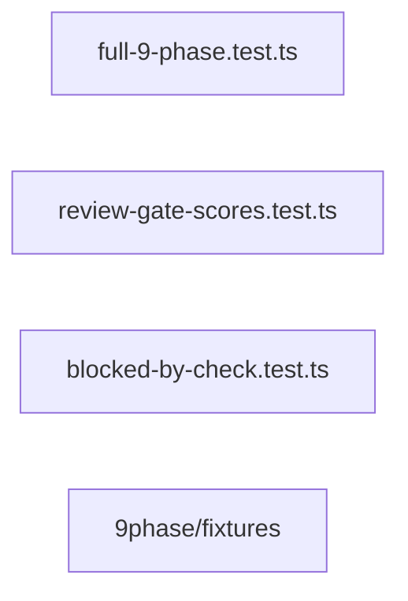

<!-- phase:design skill:taiyi-design gate:human est:30min produces:DESIGN.md upstream:[requirement] downstream:[task,ui-design] cplx:[ALL]4steps +[M+]6 +[H]1 (+opt:1) -->
# DESIGN: E2E 九阶段全流程集成测试 — 测试架构设计

> **一句话**: vitest + TypeScript

---

## Step 1: Context & Constraints
> **[ALL]** Goal: 框定设计边界 | Inputs: REQUIREMENT.md §2, §4, §8
<!-- Action: 技术栈全貌 + 约束条件 -->

- **选定**: vitest + TypeScript
  理由: 项目已使用 vitest 作为测试框架；TypeScript 确保 fixture JSON 类型匹配 Zod schema
- **约束**: 

<!-- Validate: 约束覆盖技术/性能/兼容性/时间/团队？ -->

## Step 1a: Current State
> **[ALL]** Goal: 变更前基线，ADR 强制覆写模式 | Inputs: CHANGE.md §1
<!-- Action: 记录变更前的架构/行为状态。ADR 模式：强制覆写 DESIGN.md，不准 append-only -->

**当前架构/行为**:

engine 已支持 completePhase / getState / quality gate 校验；artifact-validator 已实现 Zod schema 校验；review 评分门禁已实现

> ⚠️ **ADR 覆写规则**: 此 DESIGN.md 是当前变更的设计真源，**强制覆写**而非追加。每次设计变更请覆写/更新相关节段，不要保留过时的旧设计 —— 半年后的 Agent 从此文档拼出系统全貌，不看历史版本。变更记录由 CHANGELOG.md 和 git log 承担。

<!-- Validate: 基线状态可度量？下一次变更能从此出发？ -->

## Step 1b: Dependency Sandbox
> **[ALL]** Goal: 每个依赖有版本/用途/替代方案/过时检查 | Inputs: package.json / 项目配置
<!-- Action: 列出所有新增/变更的依赖，标注版本范围、用途、替代方案、npm 最新版 -->

| 依赖 | 版本范围 | 用途 | 考虑过的替代 | npm 最新 | 过时检查 |
|------|---------|------|------------|:-------:|:--------:|
| vitest | `^2.x` | 测试框架，运行 E2E 九阶段流程测试 | node:test（内置但缺少 vitest 的 describe/it/expect 语法糖） | `` |  |

> 💡 写模板时 `npm view <pkg> version` 检查最新版本；若有 major bump 警告需说明。
> SSOT 规则：依赖变更的真源在 `package.json` / lockfile，此表为设计视角的验证清单。

<!-- Validate: 每个依赖有最新版本确认？替代方案已搜索？→如果依赖陈旧则应在此说明已在最近的 minor 上 -->

## Step 2: Architecture Overview
> **[ALL]** Goal: 一眼看清整体结构 | Inputs: Step1+REQUIREMENT.md §2
<!-- Action: Mermaid图 + 模块清单(新增/修改/删除) -->



| 模块 | 操作 | 路径 | 说明 |
|------|------|------|------|
| full-9-phase.test.ts | create | tests/core/full-9-phase.test.ts | E2E 全流程测试 — 顺序调用各阶段 helper，验证 artifact 存在和 currentPhase 推进 |
| review-gate-scores.test.ts | create | tests/core/review-gate-scores.test.ts | review 评分门禁专项测试 — ≥9.5 通过 / <9.5 拒绝 |
| blocked-by-check.test.ts | create | tests/core/blocked-by-check.test.ts | quality gate 拦截专项测试 — 缺少必填字段时 continue 被拒绝 |
| 9phase/fixtures | create | tests/fixtures/9phase/ | 测试 fixture 目录：每个阶段的完整 .json 样本（valid + invalid 两套） |

### 既有架构对齐（brownfield）
<!-- Action: 三表 — 触碰模块 / 抽象沿用 / 模式对比 -->

**触碰模块**:
- `src/core/workflow-engine.ts`（既有 · 本次修改）
- `src/core/artifact-validator.ts`（既有 · 本次修改）
- `src/schemas/*.ts`（既有 · 本次修改）
- `scripts/taiyi-forge.sh`（既有 · 本次修改）
- `tests/core/full-9-phase.test.ts`（新增）
- `tests/core/review-gate-scores.test.ts`（新增）
- `tests/fixtures/9phase/`（新增）
**禁动清单**:
- `src/commands/*`（AI 不许碰）
- `src/hooks/*`（AI 不许碰）
- `src/templates/*`（AI 不许碰）
- `docs/*`（AI 不许碰）

<!-- Validate: 禁动清单是否从 CONTEXT 复用？新增模块有没有侵入禁动区？ -->

## Step 3: Options

> **[ALL]** Goal: ≥2方案含对照 | Inputs: Step1+2
<!-- Action: 每个方案: 思路/优点/缺点/代价。A=不改/最小改动 -->

| 方案 | 名称 | 思路 | 优点 | 缺点 | 代价 |
|------|------|------|------|------|------|
| A | Monolithic 顺序测试 — 单个长测试文件 | Monolithic 顺序测试 — 单个长测试文件 | 结构简单，单文件即可跑完整流程<br>无跨文件协调开销<br>适合第一次实现时快速验证<br> | 单文件过长（预计 400+ LOC），维护困难<br>中途失败难以定位（beforeEach 链复杂）<br>不能独立测试单个阶段逻辑<br>CI 中无法并行<br>失败后重跑整个流程<br> | ~400 LOC，1 test file |
| B | Composable 分阶段测试套件 — 每阶段一个测试文件 + 协调器 | Composable 分阶段测试套件 — 每阶段一个测试文件 + 协调器 | 每阶段独立文件（~80 LOC 每个），维护清晰<br>可独立运行某阶段的验证<br>单阶段失败不影响其他阶段测试结果<br>符合 project 既有测试组织风格<br> | 需要协调器处理「上一阶段输出 → 下一阶段 fixture」的传递<br>状态共享需 fixture 目录或 shared context<br>协调器本身需额外维护<br> | ~500 LOC (10 files total) |
| C | State-machine driven test harness — 可复用的 PhaseTestHarness 类 | State-machine driven test harness — 可复用的 PhaseTestHarness 类 | 最高复用性：换 slug 和 fixture 即可测试任意 change<br>Harness 封装了 engine API 调用和状态校验<br>CI 中可轻松参数化运行<br>测试代码量最小（harness 一次编写，测试仅声明「什么阶段→什么 artifact→什么校验」）<br>最适合回归测试场景<br> | 初期编写 harness 有一定成本<br>抽象层可能掩盖引擎内部细节使调试变困难<br>需随 engine API 变化同步维护 harness<br> | ~600 LOC (harness class ~200, test files ~400) |

<!-- Validate: ≥2方案？含"不改"对照？代价量化？ -->

## Step 4a: Reuse Analysis

> **[ALL]** Goal: 显式声明复用既有代码 / 模块 / 模式
<!-- Action: 列出本次会复用的现有模块、新增/修改的边界 -->

**复用既有模块**（existing / 可复用）:
- 无新增依赖 — 沿用既有 `WorkflowEngine` / `artifact-validator` / `template-seed` 等基础设施，零额外成本（性能 / 复杂度中性）。

**新增模块**（仅当确实需要）: 无

**不重写**: 复用既有 helper（这是来自 现有 模块的一种 trade-off 决策，避免 复杂度 漂移）。

## Step 4b: Decision

> **[ALL]** Goal: 选定方案并说清理由 | Inputs: Step3
<!-- Action: 基于数据/约束决策，不写"感觉这个好" -->

- **Chosen:** B
- **Reason:** Composable 分阶段套件在项目初期提供了最佳平衡：每阶段独立文件符合既有测试习惯，测试组织清晰，CI 可选择性运行，不需要引入额外抽象层。Option C（harness）是更成熟的方案但当前 E2E test 只需验证一次全流程，harness 的成本不值得在当前阶段支付；Option A（monolithic）虽然最简单但单文件 400+ LOC 维护成本高。
- **取舍:** 选择了可维护性而非极简性（弃 A）；选择了简单性而非最大复用（弃 C）；未来如需要跑多个 change 回归测试，可再将 B 升级为 C

<!-- Validate: 理由基于数据/约束而非主观？ -->

## Step 5: Detailed Design
> **[MEDIUM+]** Goal: 落地细节完整 | Inputs: Step4
<!-- Action: DDL+API契约+时序图 -->

### 数据模型
```sql
每个测试文件接受一个 change slug（e2e-9phase-workflow），调用 engine API 创建/推进/验证；fixture 目录按阶段命名（change.json / requirement.json / ...）
```

### API 设计
```
无 — 全部使用已有 engine 导出 API（completePhase, getState, initPhase）
```

### 关键流程
test init → verify .taiyi/changes/{slug}/ 目录创建 → complete change → verify currentPhase='requirement' → ... → complete integration → verify currentPhase='completed'

<!-- Validate: DDL有索引？API有rate limit？流程有错误路径？ -->

## Step 6: Blast Radius
> **[MEDIUM+]** Goal: 每个决策的最坏情况 | Inputs: Step2+4
<!-- Action: 决策→爆炸半径→最坏情况→隔离措施 -->

| 决策 | 半径 | 最坏情况 | 隔离 |
|------|:--:|---------|------|
| 新增测试文件到 tests/core/ | tests/core/ 目录新增 3 个 test 文件 | test 文件与已有测试文件命名冲突 | 使用独立 describe block，不与既有 test 交织 |
| 新增测试 fixture 到 tests/fixtures/9phase/ | tests/fixtures/ 目录新增 9phase/ 子目录 | fixture 与真实 .taiyi/changes/ 路径混淆导致误操作 | fixture 使用完全独立的 slug (e2e-test-9phase)，不影响已有 change |

<!-- Validate: 有没有一个变更能影响所有用户？半径可控？ -->

> 📎 **SSOT 规则**: 风险真源见 [CHANGE.md §Risks](CHANGE.md)。Blast Radius 从架构视角验证已声明的业务风险，不重复定义。

## Step 7: Innovation Token Accounting
> **[MEDIUM+]** Goal: 不浪费创新额度 | Inputs: Step2+5
<!-- Action: 新技术/新Infra必须说明理由。每公司约3token -->


**累计: 0/3**

<!-- Validate: ≤3？每个"是"有充分理由？ -->

## Step 8: Trade-off Analysis
> **[MEDIUM+]** Goal: 诚实面对取舍 | Inputs: Step4+5
<!-- Action: 选择了什么/代价是什么/为什么接受 -->

| 权衡点 | 选择 | 接受理由 |
|--------|------|---------|
| 分阶段 vs 整体文件 | 分阶段文件 | 每阶段独立文件维护清晰，可独立运行；代价是需协调器传递上下文 |
| Harness 抽象层 | 暂不加 harness 层 | 当前只需验证一次全流程，harness 成本不值；未来回归测试增多时可升级 |

<!-- Validate: 每个权衡都说清了"接受代价的理由"？ -->

## Step 9: Distribution & Deployment
> **[MEDIUM+]** Goal: 确保能发布 | Inputs: Step5
<!-- Action: 新artifact类型？CI/CD变更？回滚方式？ -->

- **新artifact**: 无
- **CI/CD变更**: 
- **回滚方式**: 

<!-- Validate: 新artifact的build/publish/update流程完整？ -->

## Step 10: Security Model
> **[HIGH]** Goal: 威胁建模仿真 | Inputs: Step5+REQUIREMENT.md §9
<!-- Action: STRIDE威胁建模+缓解 -->

| 威胁 | 攻击向量 | 缓解 |
|------|---------|------|
| 测试 fixture 包含真实路径信息 | fixture JSON 存放于 tests/fixtures/ 目录，可能被错误引用到生产 .taiyi/changes/ | fixture 使用独立 slug 'e2e-test-9phase'，不与真实 change slug 冲突 |

<!-- Validate: OWASP Top10全覆盖？敏感数据加密+日志脱敏？ -->

> 📎 **SSOT 规则**: 安全策略真源见 [CHANGE.md §Risks](CHANGE.md) + [REQUIREMENT.md §Non-Functional Security](REQUIREMENT.md)。STRIDE 威胁建模从此派生，不独立重评估。

## Step 11: Rollout Strategy
> **[MEDIUM+]** Goal: 上线有计划 | Inputs: Step6+9
<!-- Action: 灰度比例+观察时间+回滚触发 -->

- 1. 创建 tests/fixtures/9phase/ 目录及 valid/invalid fixture JSON
- 2. 编写 full-9-phase.test.ts（顺序调用 engine API）
- 3. 编写 review-gate-scores.test.ts（评分门禁专项）
- 4. 编写 blocked-by-check.test.ts（quality gate 拦截专项）
- 5. 运行所有测试，确认全部 pass

> 📎 **SSOT 规则**: 回滚真源见 [CHANGE.md §Risks](CHANGE.md)。此处为部署视角的灰度/上线步骤，与 CHANGE 的 rollback_{trigger,ops,time} 互不重复。若此处的回滚方式 != CHANGE 声明的，即视为 SSOT 违规。

## Step 12: Architecture Evolution
- [reusable-abstraction] 如果后续需要为每个 PR 运行完整的九阶段回归测试，建议提取 PhaseTestHarness 类（Option C），将 fixture 参数化

---
## Step 13: Code Generation Contract
> **[ALL]** Goal: DESIGN→TASK→DEV 三阶段代码生成链 | Inputs: Step 2+5
<!-- Action: 结构化文件清单 → TASK 按文件拆分 Slice → DEV 逐文件生成 -->


<!-- Validate: module_manifest 覆盖所有模块？每模块 pattern 匹配实际代码结构？ -->

---
## Quality Gate
<!-- Evidence-first: 每项通过需要可验证证据，不是"感觉对了"。ECC verification-loop 取代 Superpowers verification-before-completion -->

- [ ] S1 约束完整
- [ ] S2 架构图+模块清单清晰
- [ ] S3 ≥2方案含对照
- [ ] S4 决策基于数据
- [ ] [M+] S5 含DDL+API+流程
- [ ] [M+] S6 Blast Radius已评估
- [ ] [M+] S8 权衡分析诚实
- [ ] [M+] S9 部署流程完整
- [ ] [H]  S10 STRIDE已建模
- [ ] [M+] S11 灰度+回滚明确
- [ ] **2-week smell**: 合格工程师2周内能交付一个小feature？cognitive#11
- [ ] **Refactor-first**: 重构和功能改动分开了吗？cognitive#13: 先让改动变简单，再做简单改动
