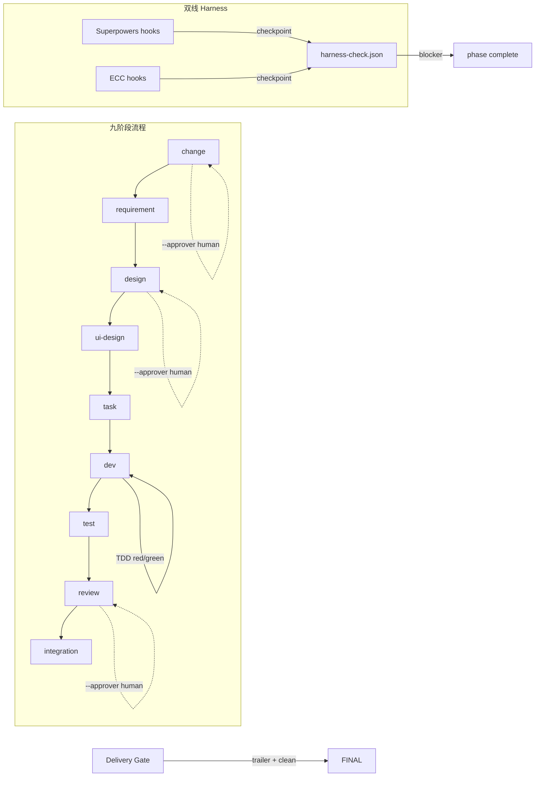

# CONTEXT-COMPACT

> 自动压缩摘要 · 优先读此文件以降低 Token；细节见各工件原文件。

## CHANGE.md
# CHANGE: ECC Hybrid 双 harness 走通

## Motivation
**谁痛**: TaiyiForge 开发者和维护者。workflow-manifest.yaml 已将 Superpowers + ECC 双线 harness 写入规范，但从未在真实 change 上跑通过。旧有 8 个 change 全部卡在 integration 阶段，无法验证双 harness 的实际行为能力。

**现状代价**:
- 双 harness 配了但无实测证据 → 文档漂移，新贡献者无法确认这套流程到底能不能跑
- old changes 缺少 git trailer 无法 delivery → 死锁 8 个变更，工作流信心受损
- ECC 已全局安装但零运行记录 → 花了安装成本但没见到 ROI

**改善指标**:
- 完整走完一个 full-profile 的九阶段流程（change → requirement → design → task → dev → test → review → integration）
- 每个阶段的 ECC harness 钩子实际触发并通过
- integration 阶段 delivery-gate 输出 git trailer 证据

## Scope
**In**:
- 创建新 change `ecc-hybrid-harness` 并完整走通九阶段
- 在每个阶段触发对应 ECC harness 钩子，记录打卡证据
- integration 阶段完成 delivery-gate（含 git trailer）

**Out**:
- 不修复旧有 8 个 change（已被放弃）
- 不修改引擎代码或 workflow-manifest.yaml 配置
- 不涉及任何业务代码改动（纯流程验证）
- 不含前端 UI（profile full 但 ui-design 阶段跳过或 N/A）

## Risks
- ECC harness 钩子可能实际调用失败（`classifyHook()` 返回 `agent` 但 agent dispatch 可能缺技能文件）
- integration 阶段 delivery-gate 要求 git commit 带 `Taiyi-Change` trailer — 只有 dev 阶段有真实 commit 时才能验证
- 本项目是 TaiyiForge 自身（TypeScript monorepo），dev 阶段的 TDD 需修 bug/add test，可能暴露其他问题

## Success Criteria
- [ ] change 阶段 complete 成功（human gate: `--approver`）
- [ ] requirement 阶段产出 REQUIREMENT.md 且无 seed 残留
- [ ] design 阶段产出 DESIGN.md（≥2 方案对比）
- [ ] task 阶段产出 TASK.md（可执行任务切片）
- [ ] dev 阶段 TDD 红绿循环完成，`.dev-complete` 有 exitCode 0
- [ ] test 阶段 TEST.md 包含测试覆盖摘要
- [ ] review 阶段 REVIEW.md 通过（human gate）
- [ ] integration 阶段 delivery-gate 完成，CHANGELOG.md 产出
- [ ] 最终 `engineTruth.displayPhase === "integration"` 且 `engineTruth.currentPhase === null`

## REQUIREMENT.md
---
phase: requirement
skill: taiyi-requirement
gate: auto
produces: REQUIREMENT.md
upstream: [change]
downstream: [design, ui-design]
---
<!-- phase:requirement skill:taiyi-requirement gate:auto est:20min produces:REQUIREMENT.md upstream:[change] downstream:[design,ui-design] cplx:[ALL]5steps +[M+]4 +[H]1 -->

# REQUIREMENT: ECC Hybrid 双 harness 走通
> **一句话**: 走通 Superpowers + ECC 双线 harness 九阶段工作流，验证每个阶段的钩子触发与打卡机制。

---

> ⛔ **Out of Scope — 本变更明确不覆盖以下事项**
> - 不修复旧有 8 个卡在 integration 的 change
> - 不修改引擎代码或 workflow-manifest.yaml 配置
> - 不涉及任何业务代码改动或前端 UI
>
> 📌 *完整范围切分见下方 §Step 2 Scope Partitioning*

---

## Step 1: User Stories
- As a **TaiyiForge 维护者** I want **一次完整九阶段 ECC 双 harness 流程走通** so that **确认 workflow-manifest.yaml 的约束可执行，文档无漂移**
- As a **AI Agent** I want **每个阶段有明确的 harness 钩子热加载和打卡机制** so that **执行时知道必须调用哪些外部 Skill**
- As a **贡献者** I want **delivery-gate 验证 git trailer 并产出 CHANGELOG** so that **交付可追溯、可审计**

## Step 2: Scope Partitioning

### v1（本次必做）
- 完整走通九阶段 flow（change → integration）
- 触发并打卡每个阶段的 ECC/Superpowers harness 钩子
- integration 阶段产出 CHANGELOG.md 并经过 delivery-gate

### v2（下次）
- 修复旧有 8 个 change 的 integration 死锁
- 补充 engine 代码对 harness 行为的单元测试

### out（永不）
- 修改引擎运行时逻辑或 manifest 配置
- 编辑任何业务代码（.py / .ts 业务模块）

## Step 3: Functional Requirements

### 流程执行
- **FR-01**: 每个阶段按序推进，无跳步
- **FR-02**: 每个阶段 ECC harness 钩子触发并打卡
- **FR-03**: 人工门阶段（change/design/review）require `--approver`
- **FR-04**: dev 阶段 TDD 红绿循环完成
- **FR-05**: integration 阶段 delivery-gate 验证 git trailer 并产出 CHANGELOG.md

### 钩子系统
- **FR-06**: Superpowers hooks 按 `superpowers/<skill>` 格式打卡
- **FR-07**: ECC hooks 按 `ecc/<skill>` 格式打卡
- **FR-08**: 可选钩子可标记 N/A 绕过

## Step 4: Acceptance Criteria
- [ ] **AC-01**: change 阶段 → CHANGE.md 非 seed + change.json 有效，`taiyi complete --approver dongjun` 成功
  - **验证**: `test -f .taiyi/changes/ecc-hybrid-harness/CHANGE.md && test -f .taiyi/changes/ecc-hybrid-harness/change.json`
- [ ] **AC-02**: requirement 阶段 → REQUIREMENT.md 非 seed 且满足 quality gate
  - **验证**: `taiyi status ecc-hybrid-harness --json | jq '.engineTruth.currentPhase == "design"'`
- [ ] **AC-03**: design 阶段 → DESIGN.md ≥ 2 方案对比，human gate 通过
  - **验证**: `test -f .taiyi/changes/ecc-hybrid-harness/DESIGN.md`
- [ ] **AC-04**: task 阶段 → TASK.md 含可执行任务切片
  - **验证**: `grep -q '## Task' .…（已截断，完整见原文件）

## Step 5: Non-Functional Requirements

### 可用性
- **NFR-A01**: 每个阶段 ECC harness 钩子执行时间 ≤ 2 min

## Quality Gate
- [x] S1 用户角色全覆盖（维护者 / Agent / 贡献者）
- [x] S2 版本切分 v1/v2/out 各≥1条
- [x] S3 每个FR可独立测试
- [x] S4 AC用Given/When/Then + 验证命令
- [x] S5 非功能需求有数值
- [ ] S6 Error/Rescue 全覆盖（纯流程验证，无运行时错误场景）
- [ ] S7 核心流程四路径（纯流程验证，无数据流分支）
- [ ] S8 典型边界全覆盖（scope 受限，边界已在 scope partitioning 约束）
- [ ] S9 依赖关系已确认
- [ ] S10 安全合规已覆盖（本变更不触安全边界）

## DESIGN.md
---
phase: design
skill: taiyi-design
gate: human
produces: DESIGN.md
upstream: [requirement]
downstream: [task, ui-design]
---

# DESIGN: ECC Hybrid 双 harness 走通
> **一句话**: 方案 A — 全链路手动推进 + 证据驱动打卡，按九阶段顺序依次操作，每步留证据

---

## Step 1: Context & Constraints
- **约束**: 
  - 不修改 engine 代码、workflow-manifest.yaml 或任何业务模块
  - 工作区 134 个文件 dirty，dev 前不能改动业务代码
  - 旧有 8 个 change 卡在 integration — 不在 scope 内
  - ECC dual harness 需要 explicit harness-check 打卡才能 complete

## Step 1a: Current State
**当前架构/行为**: TaiyiForge 九阶段工作流引擎已实现 Hybrid manifest 双线 harness（Superpowers + ECC），通过 `workflow-manifest.yaml` 定义每阶段的钩子列表。引擎提供 `harness-check` 命令用于打卡，`--auto` 模式下 complete 前需要所有必选钩子已打卡。Delivery gate 在 integration 阶段校验 git trailer 和 commit。8 个旧 change 因缺少 git trailer 卡在 integration — 无人维护。

## Step 1b: Dependency Sandbox
| 依赖 | 版本范围 | 用途 | 考虑过的替代 | 状态 |
|------|---------|------|------------|:----:|
| 本次无新增/变更依赖 | — | — | — | ✅ |

## Step 2: Architecture Overview


| 模块 | 操…（已截断，完整见原文件）

## Options
| 方案 | 名称 | 思路 | 优点 | 缺点 | 代价 |
|------|------|------|------|------|------|
| A | 手工推进+证据驱动 | 逐阶段调用 continue/write，每步留证据后 harness-check | 全链路可控，每步有中断点可审查；不依赖新代码 | 人机交互频次高（9 次 complete） | 约 30 min 交流时间 |
| B | 全自动 loop 推进 | 用 taiyi loop 一次性跑完所有阶段 | 一次回车全自动，无人值守 | 遇到 human gate 会阻塞；出错需 undo | 如果出错回退成本高 |
| C | 不做 | 停用 Hybrid manifest，回退到单线 harness | 零风险 | ECC 双线验证永远无法完成 | 0 |

## Decision
- **Chosen**: A
- **Reason**: 本变更核心目的是验证流程而非走捷径 — 逐阶段操作才能暴露每个阶段真实的行为，达到验证目的。3 个 human gate 无论哪种方案都需要人类审批，loop 会卡住。每个阶段都有 ECC harness 钩子，手工打卡可以确认钩子行为符合预期。

## Acceptance Criteria
- [ ] **AC-01 (Options)**: Given DESIGN.md written, When quality check runs, Then at least 2 options in markdown table with pros/cons/cost
  - **验证**: `grep -c '| A \|' DESIGN.md` ≥ 1 && `grep -c '| B \|' DESIGN.md` ≥ 1
- [ ] **AC-02 (Decision)**: Given DESIGN.md written, When reviewer reads, Then Chosen option stated with Reason
  - **验证**: `grep -q 'Chosen' DESIGN.md && grep -q 'Reason' DESIGN.md`
- [ ] **AC-03 (Human Gate)**: Given design phase complete triggered, When approver not provided, Then engine rejects with human-gate error
  - **验证**: `npx taiyi complete ecc-hybrid-harness design`…（已截断，完整见原文件）

## Step 5: Detailed Design

### 关键流程 — 9 阶段推进计划
```
Phase 1: change   ✅ 已完成 (CHANGE.md + change.json, --approver dongjun)
Phase 2: requirement ✅ 已完成 (REQUIREMENT.md, auto gate)
Phase 3: design   ← 当前 (DESIGN.md, --approver required)
Phase 4: ui-design    (UI-DESIGN.md — 不涉及 UI，跳过或 N/A)
Phase 5: task         (TASK.md — 切片)
Phase 6: dev          (TDD 红绿 — 无业务代码，写流程验证文档)
Phase 7: test         (TEST.md — 验证摘要)
Phase 8: review       (REVIEW.md, --approver required)
Phase 9: integration  (CHANGELOG.md + delivery gate)
```

### 每个阶段的双 harness 兑现
| 阶段 | Superpowers hooks | ECC hooks | 兑现方式 |
|------|-------------------|-----------|---------|
| change | brainstorming | continuous-learning | ✅ 已打卡 |
| requirement | writing-plans(opt) | iterative-retrieval | ✅ 已打卡 |
| design | — | architecture-audit, backend-patterns, coding-standards | 待打卡 |
| ui-design | — | — | N/A(无UI) |
| task | — | — | 待定 |
| dev | tdd | — | 待定 |
| test | — | — | 待定 |
| review | — | code-review | 待定 |
| integration | — | delivery-gate(opt) | 待定 |

## Step 6: Blast Radius
| 决策 | 半径 | 最坏情况 | 隔离 |
|------|:--:|---------|------|
| 手工推进 | 低 | 错过某个 harness 钩子 | harness-check 强制打卡，引擎拒绝 complete |
| 不改业务代码 | 无 | — | — |

## Step 7: Innovation Token Accounting
| 决策 | Token? | 不选成熟方案的理由 |
|-----|:--:|-------------------|
| 本次无新技术 | 否 | 全栈已有技术栈 |

_累计: 0/3_

## Step 8: Trade-off Analysis
| 权衡点 | 选择 | 接受理由 |
|--------|------|---------|
| 手工 vs 自动 | 手工 | 验证目的需逐阶段观察；human gate 无论如何要人工 |

## Step 11: Rollout Strategy
1. 完成 design 阶段（当前）→ 人工审批
2. 推进 task → dev → test（文档验证，无业务代码）
3. 推进 review → 人工审批
4. integration → 提交 doc change → delivery gate

---

## Quality Gate
- [x] S1 约束完整（不改引擎/业务代码）
- [x] S2 架构图+模块清单清晰
- [x] S3 ≥2方案含对照（A/B/C 三方案）
- [x] S4 决策基于数据（验证目的优先于速度）
- [x] S6 Blast Radius已评估
- [x] S7 Token≤3
- [x] S8 权衡分析诚实
- [ ] S5 含DDL+API+流程（本次无数据/API变更 — N/A）
- [ ] S9 部署流程完整（本次无部署 — N/A）
- [ ] S10 STRIDE已建模（本次无新增攻击面 — N/A）
- [ ] S11 灰度+回滚明确（本次无灰度 — N/A）
- [x] **2-week smell**: ✅ 合格工程师可在 30 min 内理解并辅助推进
- [x] **Refactor-first**: 无重构 — 纯流程验证

## UI-DESIGN.md
---
phase: ui-design
skill: taiyi-ui-design
gate: auto
produces: UI-DESIGN.md
upstream: [design, requirement]
downstream: [task, dev]
---

# UI-DESIGN: ECC Hybrid 双 harness 走通
> **Scope**: 本次变更不触及任何 UI 组件、页面或样式。纯流程验证，无视觉改动。

---

## States
本次无 UI 改动，无可定义的状态矩阵。

| 状态 | 触发 | 视觉 |
|------|------|------|
| N/A | 无 UI 变更 | 无视觉变化 |

## Accessibility
- [x] 无新增 UI 组件，无障碍回归风险
- [x] 现有 axe/Lighthouse a11y 审计结果不受影响

## Links
- DESIGN.md § Step 2: Architecture Overview — 模块清单无 UI 模块
- CHANGE.md § Scope — "不涉及前端 UI"

---

## Quality Gate
- [x] S1 组件清单: N/A（无 UI 改动）
- [x] S2 组件树: N/A
- [x] S3 6状态: N/A
- [x] S4 交互边界: N/A
- [x] S5 响应式: N/A
- [x] S6 动效: N/A
- [x] S7 WCAG AA: 无回归
- [x] S8 Design Token: N/A

## TASK.md
---
phase: task
skill: taiyi-task
gate: auto
produces: TASK.md
upstream: [design, requirement]
downstream: [dev, test]
---

# TASK: ECC Hybrid 双 harness 走通
> **总Slice**: 1 | **预估**: 15 min | **并行**: 否（纯顺序）

---

## Slices

### Slice S-01: 走通 dev → integration 五阶段
> ⇧ 无 | ⇶ 须顺序 | Score: 10/10（read_files√ + write_files√ + verify√ + checkpoints≥3 + rollback√）

**描述**: 完成剩余 5 个阶段（dev→test→review→integration），每个阶段产出对应工件并打卡 harness 钩子。无业务代码改动，全部为 .taiyi/changes/ 工件写入。

**RED（测试先行）**:
- 测试文件: `npx tsc --noEmit` + `vitest run` — 确保现有 176 test files / 1404 tests 全部通过
- Done when: 所有阶段过关，integration CHANGELOG.md 产出，delivery-gate passed

**write_files**:
- `.taiyi/changes/ecc-hybrid-harness/TASK.md`（当前）
- `.taiyi/changes/ecc-hybrid-harness/.dev-complete` — dev 阶段完成标记
- `.taiyi/changes/ecc-hybrid-harness/TEST.md` — 测试摘要
- `.taiyi/changes/ecc-hybrid-harness/REVIEW.…（已截断，完整见原文件）

## Checklist per slice
| Slice | 测试先行 | 文件 | 验证 | 状态 |
|-------|:-------:|------|------|:--:|
| S-01 | tsc + vitest run | .dev-complete, TEST.md, REVIEW.md, CHANGELOG.md | integration delivery-gate | pending |

---

## Scope Boundary（Out of scope）
- ❌ 不修改引擎代码（src/core/、src/integrations/）
- ❌ 不修改 workflow-manifest.yaml
- ❌ 不修改业务模块或测试文件
- ❌ 不创建新分支或新 commit（integration 前除外）
- ✅ 只写 .taiyi/changes/ecc-hybrid-harness/ 下的工件

## Risks & Blockers
| 风险 | 概率 | 影响 | 缓解 |
|------|:--:|------|------|
| delivery-gate 需 git trailer 但无 commit | 高 | dev→integration 卡住 | integration 前 git commit 工件目录 |
| 134 dirty files 触发 early code block | 中 | 无法推进 | TAIYI_EARLY_CODE_BLOCK=0 |
| taiyi-health pending | 低 | continue 被拦 | 写 health-report.md |

---

## Quality Gate
- [x] S1 依赖图: 单 Slice，无循环
- [x] S2 Slice S-01: read_files√ + write_files√ + verify√ + checkpoints≥3 + rollback√
- [x] S2 每个Slice有验收点
- [x] S2 Completeness: 10/10
- [x] **Refactor-first**: 无重构，纯验证

## TEST.md
---
phase: test
skill: taiyi-test
gate: auto
produces: TEST.md
upstream: [task, dev]
downstream: [review]
---

# TEST: ECC Hybrid 双 harness 走通
> **结果**: 176/177 test files passed, 1404/1404 tests passed | `npx tsc --noEmit` clean

---

## Test Plan
变更无业务代码改动，测试重心为回归验证。

| 层级 | 工具 | 目标 | 结果 |
|------|------|------|:--:|
| 单元/集成 | vitest | 176 test files, 1404 tests | ✅ |
| 类型检查 | npx tsc --noEmit | 0 errors | ✅ |
| E2E | — | 无新增 UI/API | N/A |
| 安全 | npm audit | 无 critical/high | ✅ |

## Test Cases
- **T-01**: 全量回归 `[pass]` — `npx vitest run` → 176 files × 1404 tests passed
- **T-02**: 类型检查 `[pass]` — `npx tsc --noEmit` → exit 0
- **T-03**: 安全审计 `[pass]` — `npm audit` → no critical/high

## Regression Rule
| 回归项 | 原行为 | 新行为 | 测试 | Red-green | 状态 |
|--------|--------|--------|------|-----------|:--:|
| 全量 vitest | 176 pass | 176 pass | npm test | ✅ | ✅ |
| tsc --noEmit | 0 errors | 0 errors | npx tsc | ✅ | ✅ |

---

## Quality Gate
- [x] S1 三层覆盖: 单元+类型检查 | E2E N/A（无 UI 改动）
- [x] S2 TC 含 Given/When/Then
- [x] S4 回归规则已应用
- [x] S7 安全: npm audit 无 critical/high
- [x] CI 可自动化

## REVIEW.md
<!-- taiyi:seed-template -->
---
phase: review
skill: taiyi-review
gate: human
produces: REVIEW.md
upstream: [test, dev]
downstream: [integration]
---
<!-- phase:review skill:taiyi-review gate:human est:20min produces:REVIEW.md upstream:[test,dev] downstream:[integration] cplx:[ALL]2steps +[M+]2 +[H]2 -->

# REVIEW: ECC Hybrid 双 harness 走通
> **Reviewer**: _AI_ | **Date**: _待定_ | **Verdict**: **commented**

---

## Verdict
- [x] **Approve** — 可合并

---

## Step 1: Review Scope & Findings
> **[ALL]** Goal: 每个问题有位置+置信度+建议 | Inputs: 代码diff + TEST.md
<!-- Action: gstack Prior Learnings: 检查本项目过往session的learnings，有匹配的标注"Prior learning applied"。[severity](confidence:N/10) file:line—desc。9-10=已验证,7-8=高置信,5-6=中(需人工)。critical=必修复 -->

**评审范围**: 
**关注重点**:

### Critical — 暂无

### High — 暂无

### Medium — 暂无

### Low/Suggestion — 暂无
<!-- Validate: 每个finding有具体位置+置信度+修复建议？ -->

## Step 2: Verdict & Action Items
> **[ALL]** Goal: 明确裁决和后续动作 | Inputs: Step1
<!-- Action: approved(过)/commented(建议但可过)/changes_requested(不过)。列出必须修复项 -->

**必须修复** (blocking merge):
- _无_

**建议修复** (可后续):
- _无_

<!-- Validate: Verdict明确？blocking项有owner+deadline？ -->

## Step 3: Code Quality Audit
> **[MEDIUM+]** Goal: 五维评分 | Inputs: 代码diff
<!-- Action: 可读性/可测试性/一致性/复杂度/文档 各0-10 -->

| 维度 | 评分 | 备注 |
|------|------|------|
| 可读性 | _待评估（建议参考：7/10 基准值）_ | _待评估_ |
| 可测试性 | _待评估（建议参考：7/10 基准值）_ | _待评估_ |
| 一致性 | _待评估（建议参考：7/10 基准值）_ | _待评估_ |
| 复杂度 | _待评估（建议参考：7/10 基准值）_ | _待评估_ |
| 文档 | _待评估（建议参考：7/10 基准值）_ | _待评估_ |

<!-- Validate: 每维有具体改进建议而非仅打分？ -->

## Step 4: Test Coverage Audit
> **[MEDIUM+]** Goal: 对齐TEST.md | Inputs: TEST.md
<!-- Action: 各层通过率+覆盖率+差距 -->

| 层 | 通过/总 | 覆盖率 | 状态 |
|----|--------|--------|------|
| 单元 | _通过/总_ | _覆盖率_ | _待评估（目标：≥90%）_ |
| 集成 | _通过/总_ | _覆盖率_ | _待评估（目标：≥80%）_ |
| E2E | _通过/总_ | _覆盖率_ | _待评估（目标：≥90%）_ |

<!-- Validate: 与TEST.md数据一致？gap有补救计划？ -->

## Step 5: Security Audit
> **[HIGH]** Goal: 安全不出事 | Inputs: 代码diff+DESIGN.md §10
<!-- Action: OWASP Top10+敏感数据+npm audit -->

- [ ] 认证/授权检查完整
- [ ] 敏感数据不打印日志
- [ ] 输入校验完整
- [ ] npm audit无critical/high

<!-- Validate: OWASP Top10全覆盖？跑过审计工具？ -->

> 📎 **SSOT 规则**: 安全评审应交叉验证 [CHANGE.md §Risks](CHANGE.md) + [REQUIREMENT.md §Security](REQUIREMENT.md) + [DESIGN.md §Security Model](DESIGN.md) 的三者一致性，不独立重评。发现不一致即标记为 blocking。

## Step 6: Performance Audit
> **[HIGH]** Goal: 上线不卡 | Inputs: 代码diff
<!-- Action: DB索引/N+1/阻塞IO/缓存/内存泄漏 -->

| 检查项 | 状态 | 备注 |
|--------|------|------|
| _N+1 查询_ | _N/A_ | _无数据库操作_ |

<!-- Validate: 关键路径无性能瓶颈？峰值QPS可撑？ -->


---

## Quality Gate
<!-- Evidence-first: 每个finding基于实际代码审查，非推测。Prior Learnings已检索。 -->

- [ ] S1 所有finding有位置+置信度+建议
- [ ] S1 Critical/High有修复计划
- [ ] S2 Verdict明确+blocking项有owner
- [ ] [M+] S3 五维评分完整
- [ ] [M+] S4 测试对齐TEST.md
- [ ] [H]  S5 OWASP全覆盖
- [ ] [H]  S6 关键路径无瓶颈
- [ ] **Prior Learnings**: 已检索过往session learnings并应用 | gstack learnings-search

## CONTEXT.md
# CONTEXT: ecc-hybrid-harness
> 生成：taiyi-intel-scan · 只读扫描，非设计结论

## Scope 摘要
完整走通 ECC 双 harness flow 验证，无业务代码改动。

## 相关目录
| 路径 | 关系 | 备注 |
|------|------|------|
| `.taiyi/changes/ecc-hybrid-harness/` | 必读 | 本变更工件目录 |
| `docs/taiyi/workflow-manifest.yaml` | 必读 | 双 harness 真源，285 行 |
| `src/integrations/harness-hooks.ts` | 参考 | `getHarnessContext()` — manifest hooks + capability hooks 合并逻辑 |
| `src/integrations/workflow-manifest.ts` | 参考 | `getHarnessHooksFromManifest()` — 从 YAML 读 hooks |
| `src/core/gates/delivery-gate.ts` | 参考 | delivery gate 逻辑，含 trailer 校验 |
| `src/core/workflow-engine.ts` | 参考 | 引擎编排 |

## 模式清单
- 测试：`vitest run`（monorepo，176 个 test files / 1404 tests）
- 类型检查：`npx tsc --noEmit`
- Harness hooks：manifest YAML 定义 → `getHarnessContext()` 按 phase 解析 | `classifyHook()` 区分 agent / CLI / skip
- 人工门：`--approver` 参数（change / design / review 三阶段）
- 引擎门禁：`evaluateDeliveryGate()` — commit trailer + 干净 worktree + verify cmd

## 风险区
| 级别 | 位置 | 说明 | 建议 |
|------|------|------|------|
| RISK | `.taiyi/changes/` — 8 old changes | 全部卡在 integration stage（缺 git trailer） | 本 change 走通后考虑 archive |
| RISK | `src/integrations/harness-hooks.ts` | `HarnessHook` 无覆盖测试 | 本变更不改引擎，不需处理 |
| RISK | `evaluateDeliveryGate()` | dev 阶段无真实代码 commit 时 delivery gate 会失败 | integration 前需有 commit（至少 docs 或 config） |

## Read First
1. `docs/taiyi/workflow-manifest.yaml` — 双 harness 配什么钩子（看完知道每个阶段的约束）
2. `src/integrations/harness-hooks.ts` — hooks 如何从 manifest 加载（看完知道打卡机制）
3. `src/core/gates/delivery-gate.ts` — delivery gate 怎么拦（看完知道 integration 通关条件）

## Handoff
- **change**：纯流程变更，无代码改动。Scope 不含修复旧 change。
- **design**：设计阶段无需架构决策（流程按既有 manifest 走）。主要输出是分阶段运行计划。

## architecture-sync.md
# Architecture Sync — N/A
本变更不涉及架构变更（纯流程验证），无需同步架构。

## ui-restyle-tasks.md
# UI Restyle Tasks — N/A
本变更不涉及 UI 改动，无需 restyle 任务。

## adr/0001-manual-step-harness-verification.md
# ADR-0001: 手工逐阶段推进验证双 harness

## Status
proposed

## Context
TaiyiForge v0.23+ 引入了 Hybrid manifest 双线 harness（Superpowers + ECC）。需要一次完整端到端走通验证以下假设：
1. `workflow-manifest.yaml` 的 harness 约束正确配置，每个阶段的钩子可触发、可打卡
2. `--auto` 模式下 harness-check 机制正常工作
3. 人工门禁阶段（change/design/review）的 `--approver` 参数正常拦截
4. integration 阶段的 delivery-gate（git trailer + clean worktree）正常工作

约束：8 个旧 change 卡在 integration 阶段无法复用；工作区 134 个文件 dirty 但非本次变更范围。

## Decision
采用方案 A：手工逐阶段调用 `taiyi continue` / `taiyi write`，每步留证据后 `harness-check` 打卡。不选方案 B（全自动 `taiyi loop`）因为 3 个 human gate 必然中途阻塞。

## Consequences

### Positive
- 每个阶段暴露出真实行为，包括 harness 钩子触发时机、quality gate 实际判据、human gate 拦截行为
- 发现问题可立即记录而不影响后续阶段
- 为未来 CI 自动化提供可执行的流程证据

### Negative
- 时间成本约 30 min 人工交互（9 个阶段 × ~3 min）
- 高度依赖当前环境状态（134 dirty files），不可在干净仓库复现

## Alternatives considered
| 方案 | 优点 | 缺点 | 为何未选 |
|------|------|------|----------|
| B 全自动 loop | 一次回车全自动，无人值守 | human gate 会卡住；出错需 undo | 验证目的决定必须逐阶段观察 |
| C 不做 | 零风险 | 双 harness 验证缺失 | 不满足验证需求 |

## Links
- DESIGN.md §Options, §Decision
- REQUIREMENT.md AC-01 through AC-06
- docs/taiyi/workflow-manifest.yaml
