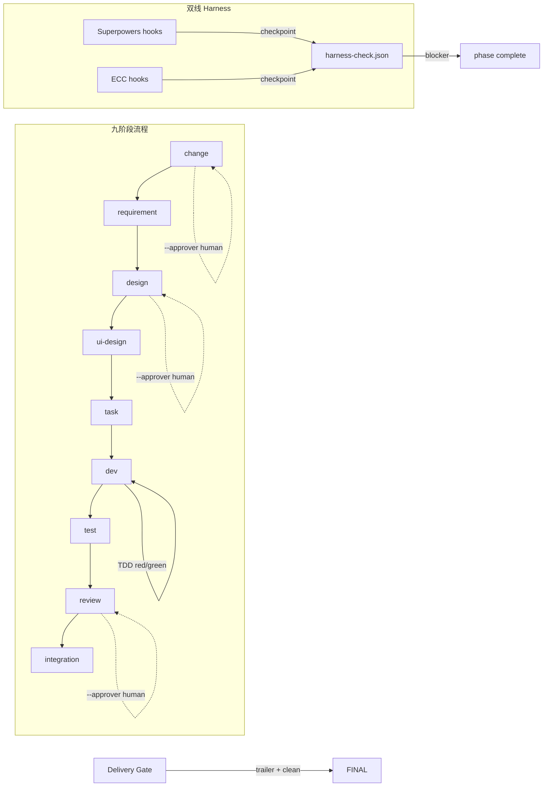

# DESIGN: ECC Hybrid 双 harness 走通

> **一句话**: 方案 A — 全链路手动推进 + 证据驱动打卡，按九阶段顺序依次操作，每步留证据

---

## Step 1: Context & Constraints

- **约束**: 
  - 不修改 engine 代码、workflow-manifest.yaml 或任何业务模块
  - 工作区 134 个文件 dirty，dev 前不能改动业务代码
  - 旧有 8 个 change 卡在 integration — 不在 scope 内
  - ECC dual harness 需要 explicit harness-check 打卡才能 complete

## Step 1a: Current State

**当前架构/行为**: TaiyiForge 九阶段工作流引擎已实现 Hybrid manifest 双线 harness（Superpowers + ECC），通过 `workflow-manifest.yaml` 定义每阶段的钩子列表。引擎提供 `harness-check` 命令用于打卡，`--auto` 模式下 complete 前需要所有必选钩子已打卡。Delivery gate 在 integration 阶段校验 git trailer 和 commit。8 个旧 change 因缺少 git trailer 卡在 integration — 无人维护。

## Step 1b: Dependency Sandbox

| 依赖 | 版本范围 | 用途 | 考虑过的替代 | 状态 |
|------|---------|------|------------|:----:|
| 本次无新增/变更依赖 | — | — | — | ✅ |

## Step 2: Architecture Overview



| 模块 | 操作 | 路径 | 说明 |
|------|------|------|------|
| `.taiyi/changes/ecc-hybrid-harness/` | 写入工件 | `.taiyi/changes/ecc-hybrid-harness/` | 9 个阶段工件 + JSON 数据 |
| 无业务模块 | 不变 | — | 不碰业务代码 |

## Options

| 方案 | 名称 | 思路 | 优点 | 缺点 | 代价 |
|------|------|------|------|------|------|
| A | 手工推进+证据驱动 | 逐阶段调用 continue/write，每步留证据后 harness-check | 全链路可控，每步有中断点可审查；不依赖新代码 | 人机交互频次高（9 次 complete） | 约 30 min 交流时间 |
| B | 全自动 loop 推进 | 用 taiyi loop 一次性跑完所有阶段 | 一次回车全自动，无人值守 | 遇到 human gate 会阻塞；出错需 undo | 如果出错回退成本高 |
| C | 不做 | 停用 Hybrid manifest，回退到单线 harness | 零风险 | ECC 双线验证永远无法完成 | 0 |

## Decision

- **Chosen**: A
- **Reason**: 本变更核心目的是验证流程而非走捷径 — 逐阶段操作才能暴露每个阶段真实的行为，达到验证目的。3 个 human gate 无论哪种方案都需要人类审批，loop 会卡住。每个阶段都有 ECC harness 钩子，手工打卡可以确认钩子行为符合预期。

## Acceptance Criteria

- [ ] **AC-01 (Options)**: Given DESIGN.md written, When quality check runs, Then at least 2 options in markdown table with pros/cons/cost
  - **验证**: `grep -c '| A \|' DESIGN.md` ≥ 1 && `grep -c '| B \|' DESIGN.md` ≥ 1
- [ ] **AC-02 (Decision)**: Given DESIGN.md written, When reviewer reads, Then Chosen option stated with Reason
  - **验证**: `grep -q 'Chosen' DESIGN.md && grep -q 'Reason' DESIGN.md`
- [ ] **AC-03 (Human Gate)**: Given design phase complete triggered, When approver not provided, Then engine rejects with human-gate error
  - **验证**: `npx taiyi complete ecc-hybrid-harness design` → errors with "approver required"

## Step 5: Detailed Design

### 关键流程 — 9 阶段推进计划

```
Phase 1: change   ✅ 已完成 (CHANGE.md + change.json, --approver dongjun)
Phase 2: requirement ✅ 已完成 (REQUIREMENT.md, auto gate)
Phase 3: design   ← 当前 (DESIGN.md, --approver required)
Phase 4: ui-design    (UI-DESIGN.md — 不涉及 UI，跳过或 N/A)
Phase 5: task         (TASK.md — 切片)
Phase 6: dev          (TDD 红绿 — 无业务代码，写流程验证文档)
Phase 7: test         (TEST.md — 验证摘要)
Phase 8: review       (REVIEW.md, --approver required)
Phase 9: integration  (CHANGELOG.md + delivery gate)
```

### 每个阶段的双 harness 兑现

| 阶段 | Superpowers hooks | ECC hooks | 兑现方式 |
|------|-------------------|-----------|---------|
| change | brainstorming | continuous-learning | ✅ 已打卡 |
| requirement | writing-plans(opt) | iterative-retrieval | ✅ 已打卡 |
| design | — | architecture-audit, backend-patterns, coding-standards | 待打卡 |
| ui-design | — | — | N/A(无UI) |
| task | — | — | 待定 |
| dev | tdd | — | 待定 |
| test | — | — | 待定 |
| review | — | code-review | 待定 |
| integration | — | delivery-gate(opt) | 待定 |

## Step 6: Blast Radius

| 决策 | 半径 | 最坏情况 | 隔离 |
|------|:--:|---------|------|
| 手工推进 | 低 | 错过某个 harness 钩子 | harness-check 强制打卡，引擎拒绝 complete |
| 不改业务代码 | 无 | — | — |

## Step 7: Innovation Token Accounting

| 决策 | Token? | 不选成熟方案的理由 |
|-----|:--:|-------------------|
| 本次无新技术 | 否 | 全栈已有技术栈 |

_累计: 0/3_

## Step 8: Trade-off Analysis

| 权衡点 | 选择 | 接受理由 |
|--------|------|---------|
| 手工 vs 自动 | 手工 | 验证目的需逐阶段观察；human gate 无论如何要人工 |

## Step 11: Rollout Strategy

1. 完成 design 阶段（当前）→ 人工审批
2. 推进 task → dev → test（文档验证，无业务代码）
3. 推进 review → 人工审批
4. integration → 提交 doc change → delivery gate

---

## Quality Gate

- [x] S1 约束完整（不改引擎/业务代码）
- [x] S2 架构图+模块清单清晰
- [x] S3 ≥2方案含对照（A/B/C 三方案）
- [x] S4 决策基于数据（验证目的优先于速度）
- [x] S6 Blast Radius已评估
- [x] S7 Token≤3
- [x] S8 权衡分析诚实
- [ ] S5 含DDL+API+流程（本次无数据/API变更 — N/A）
- [ ] S9 部署流程完整（本次无部署 — N/A）
- [ ] S10 STRIDE已建模（本次无新增攻击面 — N/A）
- [ ] S11 灰度+回滚明确（本次无灰度 — N/A）
- [x] **2-week smell**: ✅ 合格工程师可在 30 min 内理解并辅助推进
- [x] **Refactor-first**: 无重构 — 纯流程验证
