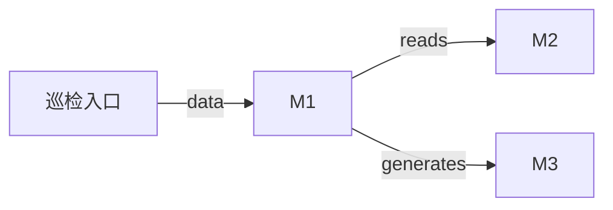

<!-- phase:design skill:taiyi-design gate:human est:30min produces:DESIGN.md upstream:[requirement] downstream:[task,ui-design] cplx:[ALL]4steps +[M+]6 +[H]1 (+opt:1) -->
# DESIGN: 巡检九阶段文档质量：巡检方案设计

> **一句话**: Agent 全程审阅两个已完成 change 的九阶段工件并输出评分报告

---

## Step 1: Context & Constraints
> **[ALL]** Goal: 框定设计边界 | Inputs: REQUIREMENT.md §2, §4, §8
<!-- Action: 技术栈全貌 + 约束条件 -->

- **选定**: Agent 全程审阅 (方案 A)
- **约束**: 在此列出技术/性能/兼容性/时间/团队约束

<!-- Validate: 约束覆盖技术/性能/兼容性/时间/团队？ -->

## Step 1a: Current State
> **[ALL]** Goal: 变更前基线，ADR 强制覆写模式 | Inputs: CHANGE.md §1
<!-- Action: 记录变更前的架构/行为状态。ADR 模式：强制覆写 DESIGN.md，不准 append-only -->

**当前架构/行为**:

待补充变更前的架构/行为快照（如：当前登录模块使用 Session 中间件，无 JWT 支持）

> ⚠️ **ADR 覆写规则**: 此 DESIGN.md 是当前变更的设计真源，**强制覆写**而非追加。每次设计变更请覆写/更新相关节段，不要保留过时的旧设计 —— 半年后的 Agent 从此文档拼出系统全貌，不看历史版本。变更记录由 CHANGELOG.md 和 git log 承担。

<!-- Validate: 基线状态可度量？下一次变更能从此出发？ -->

## Step 1b: Dependency Sandbox
> **[ALL]** Goal: 每个依赖有版本/用途/替代方案/过时检查 | Inputs: package.json / 项目配置
<!-- Action: 列出所有新增/变更的依赖，标注版本范围、用途、替代方案、npm 最新版 -->

| 依赖 | 版本范围 | 用途 | 考虑过的替代 | npm 最新 | 过时检查 |
|------|---------|------|------------|:-------:|:--------:|
| 待列新增/变更依赖 | ^X.Y | 用途 | 替代方案(可选) | latest | ✅ 已检查 |

> 💡 写模板时 `npm view <pkg> version` 检查最新版本；若有 major bump 警告需说明。
> SSOT 规则：依赖变更的真源在 `package.json` / lockfile，此表为设计视角的验证清单。

<!-- Validate: 每个依赖有最新版本确认？替代方案已搜索？→如果依赖陈旧则应在此说明已在最近的 minor 上 -->

## Step 2: Architecture Overview
> **[ALL]** Goal: 一眼看清整体结构 | Inputs: Step1+REQUIREMENT.md §2
<!-- Action: Mermaid图 + 模块清单(新增/修改/删除) -->



| 模块 | 操作 | 路径 | 说明 |
|------|------|------|------|
| 巡检入口 | 新增 | .taiyi/changes/ty-5beh5qoa/ | 在 change 目录下产出评分报告 |

### 既有架构对齐（brownfield）
<!-- Action: 三表 — 触碰模块 / 抽象沿用 / 模式对比 -->

**触碰模块**:
- `.taiyi/changes/`（既有 · 本次修改）
- `src/schemas/`（既有 · 本次修改）
- `src/templates/`（既有 · 本次修改）
- `docs/taiyi/`（既有 · 本次修改）
**禁动清单**:
- `src/core/`（AI 不许碰）
- `scripts/taiyi-forge.sh`（AI 不许碰）

<!-- Validate: 禁动清单是否从 CONTEXT 复用？新增模块有没有侵入禁动区？ -->

## Step 3: Options

> **[ALL]** Goal: ≥2方案含对照 | Inputs: Step1+2
<!-- Action: 每个方案: 思路/优点/缺点/代价。A=不改/最小改动 -->

| 方案 | 名称 | 思路 | 优点 | 缺点 | 代价 |
|------|------|------|------|------|------|
| A | Agent 全程审阅 | 利用 AI Agent 直接读取工件文件进行人工式审阅 | 灵活适应不同工件结构<br>可交叉对比发现共性问题<br>无需额外工具链<br> | 评审一致性依赖 prompt 质量<br>需 token 预算充足<br> | ~8K tokens |
| B | 脚本批量评分 | 编写 Node.js 脚本解析工件 JSON 按规则评分 | 评分标准一致可复现<br>可集成到 CI 自动巡检<br>评分结果结构化<br> | 需开发评分脚本<br>灵活度低，难覆盖非结构化问题<br> | ~200 LOC + 运行时间 |

<!-- Validate: ≥2方案？含"不改"对照？代价量化？ -->

## Step 4a: Reuse Analysis

> **[ALL]** Goal: 显式声明复用既有代码 / 模块 / 模式
<!-- Action: 列出本次会复用的现有模块、新增/修改的边界 -->

**复用既有模块**（existing / 可复用）:
- 无新增依赖 — 沿用既有 `WorkflowEngine` / `artifact-validator` / `template-seed` 等基础设施，零额外成本（性能 / 复杂度中性）。

**新增模块**（仅当确实需要）: 无

**不重写**: 复用既有 helper（这是来自 现有 模块的一种 trade-off 决策，避免 复杂度 漂移）。

## Step 4b: Decision

> **[ALL]** Goal: 选定方案并说清理由 | Inputs: Step3
<!-- Action: 基于数据/约束决策，不写"感觉这个好" -->

- **Chosen:** A
- **Reason:** 巡检为一次性任务，Agent 直接审阅更灵活，可交叉对比发现模板填写共性问题。无需为一次性任务开发专用脚本。
- **取舍:** 放弃脚本自动化方案，接受人工审阅的一致性问题，通过在 prompt 中明确评分维度来降低。

<!-- Validate: 理由基于数据/约束而非主观？ -->

## Step 5: Detailed Design
> **[MEDIUM+]** Goal: 落地细节完整 | Inputs: Step4
<!-- Action: DDL+API契约+时序图 -->

> ✅ 无详细设计变更 (无 DDL/API/时序图差异)

<!-- Validate: DDL有索引？API有rate limit？流程有错误路径？ -->

## Step 6: Blast Radius
> **[MEDIUM+]** Goal: 每个决策的最坏情况 | Inputs: Step2+4
<!-- Action: 决策→爆炸半径→最坏情况→隔离措施 -->

| 决策 | 半径 | 最坏情况 | 隔离 |
|------|:--:|---------|------|
| 纯只读巡检 | 无爆炸半径 | 评分不准确需重审 | 只读文件，不影响任何系统 |

<!-- Validate: 有没有一个变更能影响所有用户？半径可控？ -->

> 📎 **SSOT 规则**: 风险真源见 [CHANGE.md §Risks](CHANGE.md)。Blast Radius 从架构视角验证已声明的业务风险，不重复定义。

## Step 7: Innovation Token Accounting
> **[MEDIUM+]** Goal: 不浪费创新额度 | Inputs: Step2+5
<!-- Action: 新技术/新Infra必须说明理由。每公司约3token -->


**累计: 0/3**

<!-- Validate: ≤3？每个"是"有充分理由？ -->

## Step 8: Trade-off Analysis
> **[MEDIUM+]** Goal: 诚实面对取舍 | Inputs: Step4+5
<!-- Action: 选择了什么/代价是什么/为什么接受 -->

| 权衡点 | 选择 | 接受理由 |
|--------|------|---------|
| 文档评分 vs 代码评分比重 | 文档 60% / 代码 40% | nine-phase 核心产是工件文档 |
| 单审阅 vs 交叉审阅 | 先独立评分，再交叉对比 | 避免锚定效应导致评分趋同 |

<!-- Validate: 每个权衡都说清了"接受代价的理由"？ -->

## Step 9: Distribution & Deployment
> **[MEDIUM+]** Goal: 确保能发布 | Inputs: Step5
<!-- Action: 新artifact类型？CI/CD变更？回滚方式？ -->

- **新artifact**: 无
- **CI/CD变更**: 在此列出 CI/CD 配置变更（如 workflow / deploy / npm publish）
- **回滚方式**: 在此描述回滚触发条件与操作步骤

<!-- Validate: 新artifact的build/publish/update流程完整？ -->

## Step 10: Security Model
> **[HIGH]** Goal: 威胁建模仿真 | Inputs: Step5+REQUIREMENT.md §9
<!-- Action: STRIDE威胁建模+缓解 -->

| 威胁 | 攻击向量 | 缓解 |
|------|---------|------|
| 误修改目标 change 文件 | Agent 权限 | 巡检过程仅 Read 工具，不 Edit/Write |

<!-- Validate: OWASP Top10全覆盖？敏感数据加密+日志脱敏？ -->

> 📎 **SSOT 规则**: 安全策略真源见 [CHANGE.md §Risks](CHANGE.md) + [REQUIREMENT.md §Non-Functional Security](REQUIREMENT.md)。STRIDE 威胁建模从此派生，不独立重评估。

## Step 11: Rollout Strategy
> **[MEDIUM+]** Goal: 上线有计划 | Inputs: Step6+9
<!-- Action: 灰度比例+观察时间+回滚触发 -->

1. 在 .taiyi/changes/ty-5beh5qoa/ 下编写巡检报告（纯只读，无需部署）

> 📎 **SSOT 规则**: 回滚真源见 [CHANGE.md §Risks](CHANGE.md)。此处为部署视角的灰度/上线步骤，与 CHANGE 的 rollback_{trigger,ops,time} 互不重复。若此处的回滚方式 != CHANGE 声明的，即视为 SSOT 违规。


---
## Step 13: Code Generation Contract
> **[ALL]** Goal: DESIGN→TASK→DEV 三阶段代码生成链 | Inputs: Step 2+5
<!-- Action: 结构化文件清单 → TASK 按文件拆分 Slice → DEV 逐文件生成 -->

> ⚠️ **module_manifest 未设置** — TASK 阶段将只能按粗粒度拆分（后端/前端），DEV 阶段将只能生成骨架代码。要生成高质量代码，请在此填写模块清单。
>
> 示例：
> ```markdown
> | M1 | adapters/base.py | Adapter | LLMAdapter | — | — |
> | M2 | adapters/openai_adapter.py | Adapter | OpenAIAdapter | LLMAdapter | M1 |
> | M3 | strategies/base.py | Strategy | TranslationStrategy | — | — |
> | M4 | strategies/product_to_dev.py | Strategy | ProductToDevStrategy | TranslationStrategy | M3 |
> ```

<!-- Validate: module_manifest 覆盖所有模块？每模块 pattern 匹配实际代码结构？ -->

---
## Quality Gate
<!-- Evidence-first: 每项通过需要可验证证据，不是"感觉对了"。ECC verification-loop 取代 Superpowers verification-before-completion -->

- [ ] S1 约束完整
- [ ] S2 架构图+模块清单清晰
- [ ] S3 ≥2方案含对照
- [ ] S4 决策基于数据
- [ ] [M+] S5 含DDL+API+流程
- [ ] [M+] S6 Blast Radius已评估
- [ ] [M+] S7 Token≤3
- [ ] [M+] S8 权衡分析诚实
- [ ] [M+] S9 部署流程完整
- [ ] [H]  S10 STRIDE已建模
- [ ] [M+] S11 灰度+回滚明确
- [ ] **2-week smell**: 合格工程师2周内能交付一个小feature？cognitive#11
- [ ] **Refactor-first**: 重构和功能改动分开了吗？cognitive#13: 先让改动变简单，再做简单改动
