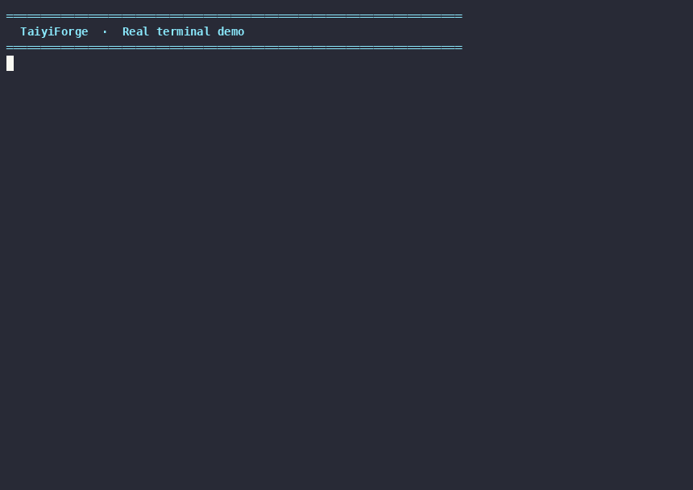

<div align="center">

**[English](README.en.md)** · [简体中文](README.md)

# TaiyiForge

**Turn six AI engineering standards into a single executable nine-stage R&D workflow**

[](LICENSE)
[](package.json)
[](https://www.npmjs.com/package/oh-my-taiyiforge)
[](https://www.npmjs.com/package/oh-my-taiyiforge)
[](CHANGELOG.md)
[](docs/taiyi/canonical-commands.md)
[](https://github.com/Dong90/oh-my-taiyiforge/actions/workflows/ci.yml)
[](docs/QUICKSTART.md)

**Document-driven AI R&D with gates, not vibes.**

> Stop memorizing the phase order. Say `/taiyi:new` and the engine tells you what's next.

[Quick Start](#quick-start) · [Usage Guide](docs/USAGE.md) · [Architecture](docs/ARCHITECTURE.md) · [Command Reference](docs/taiyi/canonical-commands.md) · [Full Flow](docs/taiyi/full-oss-flow.md) · [Contributing](CONTRIBUTING.md)

<br />


<sub>4K architecture poster (v0.23.1 · AI visual) · <a href="docs/taiyiforge-architecture.svg">vector SVG</a> · <a href="docs/c4/containers.md">C4 source</a> · <a href="docs/diagrams/visual/taiyiforge-architecture-ai-v023-full-4k-zh-v2-fix.png">中文海报</a></sub>

</div>

---

## 1 · The Problem



<sub>27-second real terminal recording · <a href="docs/diagrams/demo.cast">asciicast source</a> (playable on <a href="https://asciinema.org">asciinema.org</a> or locally with `asciinema play docs/diagrams/demo.cast`)</sub>

Every team using AI for serious work has hit some version of these:

| Pain you've hit | Why it bites |
|-----------------|--------------|
| Agent forgets the phase order mid-task and jumps to code | Lost context, half-baked designs, untested changes — review has to redo the work |
| Context explodes mid-change, requirements / design / code all lost | Long sessions die; resume from chat is impossible |
| Each of OpenCode / Claude / Codex / Cursor has its own ad-hoc flow | Same feature, four different rituals — onboarding is per-tool, not per-team |
| Even a typo fix has to go through nine stages | Rigid pipelines kill momentum on small fixes |
| Don't dare let AI decide at critical nodes | "Looks good" review without a human sign-off is gambling with prod |
| Don't know what the installed Skills are actually doing | Drift between docs and installed behavior, no audit trail |
| Want to coexist with OMC / OMX | Lock-in to one orchestrator stack kills composability |

TaiyiForge's answer to every one of these is in [§2 The Solution](#2--the-solution).

---

## 2 · The Solution

A **single nine-stage artifact contract** + **28 v28 slashes + 6 umbrellas** + **one
`/taiyi:*` vocabulary** that works the same on all four AI harnesses.

> **v28 = recommended naming + top-bar convergence. IDE menus trimmed to 28 entries (v0.24). Set `TAIYI_FORGE_ALL_PROMPTS=1` to restore the full set. See [canonical-commands.md](docs/taiyi/canonical-commands.md).**

TaiyiForge does not invent standards — it **orchestrates Harness · OpenSpec · GStack ·
Superpowers · OMO · Spec-Kit into one state machine**. Use what you have installed;
everything else is auto-skipped as optional.

### 2.1 · The Nine-Stage Workflow

One change = one slug, sequential execution, fixed artifacts. **Human gates** require
`--approver` before the engine lets you pass.

| # | Phase | Category | Skill | Artifact | Notes |
|---|-------|----------|-------|----------|-------|
| 1 | change | Human gate | `taiyi-change` | `CHANGE.md` | 3-5 paragraph proposal with scope |
| 2 | requirement | Auto | `taiyi-requirement` | `REQUIREMENT.md` | Acceptance criteria + AC checkbox |
| 3 | design | Human gate | `taiyi-design` | `DESIGN.md` | ≥2 options compared + decision |
| 4 | ui-design | Auto | `taiyi-ui-design` | `UI-DESIGN.md` | Only for changes that touch UI |
| 5 | task | Auto | `taiyi-task` | `TASK.md` | Slice into independently-PR-able pieces |
| 6 | dev | Auto | `taiyi-dev` | TDD test + minimal impl | **TDD forced** — red first, then green |
| 7 | test | Auto | `taiyi-test` | `TEST.md` | Summary kept; E2E runs in CI |
| 8 | review | Human gate | `taiyi-review` | `REVIEW.md` | Cross-AI review + high-severity must-fix |
| 9 | integration | Auto | `taiyi-integration` | `CHANGELOG.md` merged | Delivery gate: `audit` + `deliveryVerifyCmd` |
| — | archive | Cleanup | `taiyi-integration` | `.taiyi/archive/` | Only after all nine stages pass |

Full command list → **[canonical-commands.md](docs/taiyi/canonical-commands.md)** · Artifact layout → **[artifact-layout.md](docs/taiyi/artifact-layout.md)**

### 2.2 · v28 Slash Catalog (28)

Source of truth: [canonical-commands.md](docs/taiyi/canonical-commands.md) →
`canonical_v28`. Legacy slashes still work, see [Legacy compatibility](#23--legacy-compatibility).

| # | Group | Slash | Purpose |
|---|------|------|---------|
| 1–6 | Main chain | `new` · `status` · `write` · `continue` · `apply` · `archive` | Daily shortest path |
| 7–10 | Session | `handoff` · `resume` · `cancel` · `list` | Cross-session |
| 11–13 | Diagnose | `doctor` · `audit` · `verify` | Self-check + delivery gate |
| 14–17 | Delivery | `commit` · `ship` · `land` · `release` | gstack delivery chain |
| 18–19 | Routing | `gstack <skill>` · `sp <skill>` | External harness routing |
| 20–22 | Stage shortcuts | `explore` · `tdd plan\|dev` · `flow` | Skip the nine-stage |
| 23–28 | **Umbrellas (6)** | `token …` · `test …` · `review …` · `diagram …` · `mode …` · `workflow …` | Domain multi-subcommand |

**Daily shortest path**:

```text
/taiyi:new → /taiyi:write → /taiyi:continue → /taiyi:apply → … → /taiyi:commit → /taiyi:continue integration → /taiyi:archive
```

**Umbrella quick map** (full map in [canonical-commands.md §伞形命令·子命令地图](docs/taiyi/canonical-commands.md)):

| Umbrella | Sub-commands | Count |
|----------|--------------|------:|
| `/taiyi:token` | `status` · `record` · `scan` · `compress` | 4 |
| `/taiyi:test` | `smoke` · `e2e` · `qa` · `ui` · `security` | 5 |
| `/taiyi:review` | `loop` · `check` · `health` · `gstack` | 4 |
| `/taiyi:diagram` | `pipeline` · `c4` · `arch` · `render` · `flow` | 5 |
| `/taiyi:mode` | `ralph` · `autopilot` · `daemon` · `team` · `ultrawork` · `agent` · `step` · `stop` · `list` · `keyword` · `preflight` | 11 |
| `/taiyi:workflow` | `plan` · `ralplan` · `loop` · `check` · `run` · `sync` · `ccg` · `sciomc` · `deepinit` · `remember` · `ultraqa` | 11 |

### 2.3 · Legacy compatibility

Legacy slashes & CLI **still work** — listed in
[canonical-commands.md §Legacy 兼容](docs/taiyi/canonical-commands.md). Don't add new
top-bar duplicates of v28 umbrellas.

| Legacy | v28 now |
|--------|---------|
| `/taiyi:pause` | `/taiyi:handoff` |
| `/taiyi:state` · `/taiyi:state-read` | `/taiyi:status` |
| `/taiyi:next` · `/taiyi:done` | `/taiyi:status` + `/taiyi:continue` |
| `/taiyi:change` … `/taiyi:integration` | `/taiyi:write` |
| `/taiyi:ralph` etc. OMC | `/taiyi:mode ralph` |
| `npx taiyi new` · `npx taiyi walkthrough` | `/taiyi:new` · `/taiyi:flow help` |

---

## 3 · The Evidence

### 3.1 · One Skill Set, Four Harnesses

One `node scripts/taiyi-forge.sh install --all` syncs to all four harnesses; missing
ones are auto-skipped. Same 28 v28 top-bar slashes, same `taiyi-*` Skills — different
chat syntax & MCP surface per harness:

| Harness | Chat entry | Engine entry | MCP | Hook / keyword | Read more |
|---------|-----------|-------------|-----|----------------|-----------|
| **Claude Code** | `/taiyi:new … /taiyi:archive` + Skill + `~/.claude/commands/taiyi-*.md` | Agent Bash | `taiyi_doctor` · `taiyi_audit` | keyword hook | [control-plane.md §四端对照](docs/taiyi/control-plane.md) |
| **Codex** | `$taiyi-new` … `$taiyi-archive` (`prompts/taiyi-*.md` — **not** `/taiyi:*`) | Agent runs `scripts/taiyi-forge.sh` | None (shell) | `codex-keyword-preflight.mjs` + `developer_instructions` (`~/.codex/config.toml`) | [control-plane.md §Codex](docs/taiyi/control-plane.md) |
| **Cursor** | `/taiyi:new … /taiyi:status` + `taiyiforge.mdc` rule + `~/.cursor/commands/taiyi-*.md` | Agent terminal / MCP | `taiyi_doctor` · `taiyi_audit` | keyword hook | [mcp-setup.md](docs/taiyi/mcp-setup.md) |
| **OpenCode** | `taiyi_new` / `taiyi_*` plugin tools + `~/.config/opencode/commands/taiyi-*.md` | plugin + `/taiyi-*` slashes | (plugin built-in) | plugin-managed | [control-plane.md §OpenCode](docs/taiyi/control-plane.md) |

> **Codex note**: chat entry is the `$taiyi-*` keyword (not `/taiyi:*`), routed via
> `codex-keyword-preflight.mjs` and `developer_instructions`. See
> [control-plane.md](docs/taiyi/control-plane.md).

### 3.2 · Chat Track vs Engine Track

| Surface | Used by | Does what | Example |
|---------|---------|-----------|---------|
| **Chat slash** | Developer / Agent | Write artifact, run TDD, load specialized Skill | `/taiyi:write` · `/taiyi:apply` · `/taiyi:tdd dev` |
| **Engine CLI** | Agent / CI (run **for** you) | Validate artifact, gates, advance phase | `npx taiyi continue <slug>` · `npx taiyi complete <slug> change --approver "…"` |
| **Shell entry** | Agent / CI | Equivalent to CLI; written into consumer project after install | `scripts/taiyi-forge.sh status --json --compact` |
| **MCP** | Cursor etc. | Read-only troubleshooting | `taiyi_doctor` · `taiyi_audit` |

**Principle**: Users only say `/taiyi:*`; **never** make the user type
`taiyi-forge.sh` by hand. Agents read `status --json --compact` `engineTruth`;
never dump full artifacts into chat.

### 3.3 · Architecture at a Glance

```
┌─────────────────────────────────────────────────────────────┐
│  Entry: taiyi CLI · taiyi-forge.sh · OpenCode plugin · MCP    │
└───────────────────────────┬─────────────────────────────────┘
                            ▼
┌─────────────────────────────────────────────────────────────┐
│  workflow-engine — intent analysis · token budget · routing · gates │
└───────────────────────────┬─────────────────────────────────┘
                            ▼
┌─────────────────────────────────────────────────────────────┐
│  .taiyi/changes/<slug>/  — CHANGE … CHANGELOG (source of truth)  │
└─────────────────────────────────────────────────────────────┘
         chat loads taiyi-* Skill to write artifacts ↑   ↓ engine validates & advances phase
```

- Code layout → **[docs/ARCHITECTURE.md](docs/ARCHITECTURE.md)**
- C4 source → **[docs/c4/](docs/c4/)**
- Visual poster (top of README) → [docs/diagrams/visual/](docs/diagrams/visual/)

---

## 4 · Quick Start

> **Zero-build install**: v0.24.0+ supports `npx taiyi-forge-install --all` one-liner to all four harnesses without cloning the repo. Source install still available.

### Option A · One-liner install (recommended, v0.24+)

```bash
npx taiyi-forge-install --all          # One-shot to all four harnesses + optional deps
npx taiyi-forge-install --cursor       # Cursor only
npx taiyi-forge-install --claude --opencode

# Install all prompts (default is v28 28 top-bar entries only):
TAIYI_FORGE_ALL_PROMPTS=1 npx taiyi-forge-install --all
```

### Option B · Source install

```bash
git clone https://github.com/Dong90/oh-my-taiyiforge.git
cd oh-my-taiyiforge
npm install && npm run build && npm test
node scripts/taiyi-forge.sh install --all
```

### Option C · Run the example projects (zero-install quick feel)

```bash
cd examples/commands-smoke
npm install
npm run chat-demo          # Chat verbs: new / status / check / continue
npm run walkthrough-e2e    # Nine-stage shell E2E + iron-triangle
# /taiyi:doctor           # Workspace + install self-check (chat slash)
```

| Example | Purpose |
|---------|---------|
| [examples/full-flow-demo](examples/full-flow-demo/README.md) | Nine-stage + slash E2E |
| [examples/commands-smoke](examples/commands-smoke/) | Command smoke tests |
| [examples/browser-e2e-smoke](examples/browser-e2e-smoke/) | CI templates |
| [examples/verification-suite](examples/verification-suite/) | Minimal integration demo |

> Want `npm install oh-my-taiyiforge`? v0.24 is published to npm — install directly.

### Option D · Your first change (5 minutes)

```bash
# Recommended entry: auto-slug + engine guidance
npx taiyi walkthrough
npx taiyi new "Add login optimization"  # writes to .taiyi/changes/<slug>/
npx taiyi status                         # current phase + recommended Skill + next step

# Edit .taiyi/changes/<slug>/CHANGE.md, then:
npx taiyi complete <slug> change --approver "your-name"   # human gate
npx taiyi continue <slug>                                 # auto gate

# In chat (OpenCode / Claude / Cursor — Codex uses `$taiyi-*` keywords instead):
/taiyi:new "<feature title>"              # lay CHANGE.md template
/taiyi:status                             # current phase + recommended Skill + next step
/taiyi:write                              # write current phase artifact (handles 9 stages)
/taiyi:continue --approver "your-name"    # human gate (change / design / review)
/taiyi:apply                              # dev/test harness checklist
/taiyi:commit                             # post-dev commit with Taiyi-Change trailer
/taiyi:archive                            # archive after all nine stages

# Common umbrella picks:
/taiyi:doctor                             # install + workspace self-check
/taiyi:token compress <slug>              # long-session → CONTEXT-COMPACT.md
/taiyi:test smoke                         # Playwright built-in smoke
/taiyi:flow bug <slug>                    # lite path for small fixes
```

That's it. **Phase order, artifact templates, gate validation are the engine's job**.
You write Markdown and code.

Agent-priority troubleshooting:

```bash
scripts/taiyi-forge.sh doctor --json --compact
scripts/taiyi-forge.sh audit --json --compact
```

---

## 5 · Reference

### 5.1 · Documentation

| Document | What it covers | When to read |
|----------|---------------|--------------|
| [docs/QUICKSTART.md](docs/QUICKSTART.md) | 5-minute walkthrough | First install |
| [docs/USAGE.md](docs/USAGE.md) | Scenarios · daily rhythm · delivery chain | After the walkthrough |
| [docs/ARCHITECTURE.md](docs/ARCHITECTURE.md) | Architecture overview + code layout | Hacking the engine / debugging |
| [docs/taiyi/canonical-commands.md](docs/taiyi/canonical-commands.md) | v28 slash command table | Looking up a command |
| [docs/taiyi/control-plane.md](docs/taiyi/control-plane.md) | Agent discipline + token discipline | Onboarding an Agent |
| [docs/taiyi/full-oss-flow.md](docs/taiyi/full-oss-flow.md) | Superpowers + all-plugins demo | Want a full end-to-end |
| [docs/taiyi/integrations.md](docs/taiyi/integrations.md) | Iron triangle + plugin integrations | Installing optional pieces |
| [AGENTS.md](AGENTS.md) | Agent's read-state entry point | Configuring Agents |
| [CONTRIBUTING.md](CONTRIBUTING.md) | Contribution guide | Before opening a PR |
| [CHANGELOG.md](CHANGELOG.md) | Release notes | Checking for updates |
| [docs/diagrams/demo.gif](docs/diagrams/demo.gif) | Real terminal recording (27s) | Quick feel of the engine |
| [README.md](README.md) | 简体中文版 | 中文用户 |

### 5.2 · Development & Verification

**Contributor clone:**

```bash
git clone https://github.com/Dong90/oh-my-taiyiforge.git
cd oh-my-taiyiforge
npm install && npm run build && npm test
node scripts/taiyi-forge.sh install --all
```

**Common commands:**

```bash
npm test               # Vitest contracts + nine-stage E2E
npm run test:watch     # watch mode
npm run build          # TypeScript → dist/
npm run dogfood        # root repo demo (eat your own dog food)
npm run ci:platforms   # four-platform smoke (opencode/claude/codex/cursor)
npm run check:docs     # doc-vs-commands.yaml sync check
```

CI: [`.github/workflows/ci.yml`](.github/workflows/ci.yml) — platform smoke runs across
a 4 × ubuntu matrix.

### 5.3 · Roadmap & Status

| Version | Status | Key milestones |
|---------|--------|----------------|
| v0.23.0 | ✅ Released | **canonical v28**: 28 顶栏 slashes + 6 umbrellas (`token`/`test`/`review`/`diagram`/`mode`/`workflow`) + `skill-fusion-principles.md` + `validateV28CatalogSync` gate |
| v0.24.0 | 🚧 Shipping | First npm release · `npx taiyi-forge-install` zero-build install · README v28 convergence rewrite · IDE menu trimmed to 28 entries (umbrella Phase 2) |
| v1.0.0 | ⏳ Planned | Lock 9-stage API · 4-platform parity · external case-study collection |

**Ready today**: full nine-stage pipeline · four-harness shared Skills · forced TDD ·
token compression · platform-smoke CI · zero-build one-liner install (v0.24)
**Not yet**: production-grade SLA · full i18n

### 5.4 · Community & Contributing

- 🐛 **Report a bug**: [GitHub Issues](https://github.com/Dong90/oh-my-taiyiforge/issues/new) · `bug` label
- 💡 **Idea / RFC**: [Discussions](https://github.com/Dong90/oh-my-taiyiforge/discussions)
- 🔧 **Open a PR**: read [CONTRIBUTING.md](CONTRIBUTING.md) first; `npm test` + `npm run check:docs` must be green
- ⭐ **Star / Watch**: drop a star to get notified on the next release
- 🧵 **Codex users**: search for `$taiyi-*` keywords; four-harness entry decision tree in [docs/taiyi/invoke.yaml](docs/taiyi/invoke.yaml)

Code of conduct: follow the [Contributor Covenant](https://www.contributor-covenant.org/) spirit — critique ideas, not people.

### 5.5 · License

[MIT](LICENSE) © 2026 TaiyiForge contributors

### 5.6 · Acknowledgments

Inspired by: [oh-my-claudecode](https://github.com/Yeachan-Heo/oh-my-claudecode) · [oh-my-codex](https://github.com/Yeachan-Heo/oh-my-codex) · Harness Engineering · OpenSpec · GStack · Superpowers · OMO · Spec-Kit.
