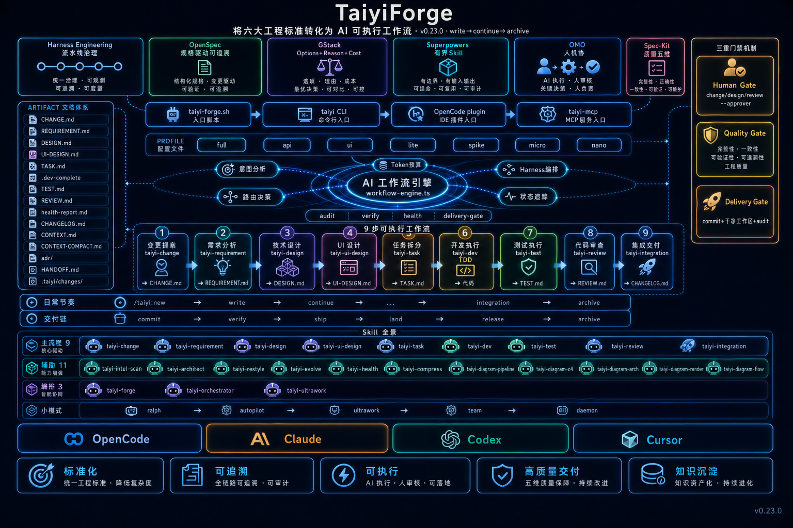

<div align="center">

**[English](README.md)** · [简体中文](README.zh-CN.md)

# TaiyiForge

**Turn six AI engineering standards into a single executable nine-stage R&D workflow**

[](LICENSE)
[](package.json)
<!-- NPM-PUBLISH-TOGGLE: open the two lines below and remove this one after v0.24
[](https://www.npmjs.com/package/oh-my-taiyiforge)
[](https://www.npmjs.com/package/oh-my-taiyiforge)
-->
[](CHANGELOG.md)
[](https://github.com/Dong90/oh-my-taiyiforge/actions/workflows/ci.yml)
[](docs/QUICKSTART.md)

**Document-driven AI R&D with gates, not vibes.**

> Stop memorizing the phase order. Say `/taiyi:new` and the engine tells you what's next.

[Quick Start](#quick-start) · [Usage Guide](docs/USAGE.md) · [Architecture](docs/ARCHITECTURE.md) · [Command Reference](docs/taiyi/canonical-commands.md) · [Full Flow](docs/taiyi/full-oss-flow.md) · [Contributing](CONTRIBUTING.md)

<br />



<sub>4K visual poster (non-technical source) · Editable source: <a href="docs/taiyiforge-architecture.svg">SVG</a> · <a href="docs/c4/containers.md">C4</a></sub>

</div>

---

## TL;DR (30 seconds)


<sub>27-second real terminal recording · <a href="docs/diagrams/demo.cast">asciicast source</a> (playable on <a href="https://asciinema.org">asciinema.org</a> or locally with `asciinema play docs/diagrams/demo.cast`)</sub>

- **What it is**: An AI R&D workflow engine that turns "requirement → design → dev → test → review → archive" into a nine-stage artifact contract, plus 23 `taiyi-*` Skills.
- **Who it's for**: Teams and individuals using OpenCode / Claude / Codex / Cursor for serious projects (medium-or-larger, with review, with delivery gates).
- **How to use it**: In your project, run `taiyi new "feature name"`. The engine guides you to write `CHANGE.md` / `REQUIREMENT.md` / `DESIGN.md` … All nine stages complete, **every intermediate artifact is auditable**.
- **Why not another standard**: TaiyiForge does not invent standards — it **orchestrates Harness · OpenSpec · GStack · Superpowers · OMO · Spec-Kit into one state machine**. Use what you have installed; everything else is auto-skipped as optional.

---

## Why TaiyiForge?

| Pain you've hit | TaiyiForge's answer |
|----------------|---------------------|
| Agent forgets the phase order mid-task and jumps to code | Previous stage incomplete → engine **rejects** `continue`; dev stage forces TDD |
| Context explodes mid-change, requirements / design / code all lost | Everything lives under `.taiyi/changes/<slug>/`; token overflow auto-writes `CONTEXT-COMPACT.md` |
| Each of OpenCode / Claude / Codex / Cursor has its own ad-hoc flow | **One set of `taiyi-*` Skills**, sync to any of the four harnesses |
| Even a typo fix has to go through nine stages? | 7 profiles (full → nano), auto-routes by change complexity |
| Don't dare let AI decide at critical nodes | change / design / review are **human gates** + `--approver`, skipped only when `--approver` is set |
| Don't know what the installed Skills are actually doing | `taiyi doctor / audit` self-check + failures / high-findings triage |
| Want to coexist with OMC / OMX | Doesn't depend on [oh-my-claudecode](https://github.com/Yeachan-Heo/oh-my-claudecode); Taiyi owns artifacts, OMX owns parallel execution |

---

## The Nine-Stage Workflow

One change = one slug, sequential execution, fixed artifacts. **Human gates** require `--approver` before the engine lets you pass.

| # | Phase | Category | Skill | Artifact | Notes |
|---|-------|----------|-------|----------|-------|
| 1 | change | Human gate | `taiyi-change` | `CHANGE.md` | 3-5 paragraph proposal with scope |
| 2 | requirement | Auto | `taiyi-requirement` | `REQUIREMENT.md` | Acceptance criteria + AC checkbox |
| 3 | design | Human gate | `taiyi-design` | `DESIGN.md` | ≥2 options compared + decision |
| 4 | ui-design | Auto | `taiyi-ui-design` | `UI-DESIGN.md` | Only for changes that touch UI |
| 5 | task | Auto | `taiyi-task` | `TASK.md` | Slice into independently-PR-able pieces |
| 6 | dev | Auto | `taiyi-dev` | TDD test + minimal impl | **TDD forced** — red first, then green |
| 7 | test | Auto | `taiyi-test` | `TEST.md` | Summary kept; E2E runs in CI |
| 8 | review | Human gate | `taiyi-review` | `REVIEW.md` | Cross-AI review + high-severity must-fix |
| 9 | integration | Auto | `taiyi-integration` | `CHANGELOG.md` merged | Delivery gate: `audit` + `deliveryVerifyCmd` |
| — | archive | Cleanup | `taiyi-integration` | `.taiyi/archive/` | Only after all nine stages pass |

Full command list → **[canonical-commands.md](docs/taiyi/canonical-commands.md)** · Artifact layout → **[artifact-layout.md](docs/taiyi/artifact-layout.md)**

---

## One Skill Set, Four Harnesses

One `taiyi-forge-install --all` syncs to all four harnesses; missing ones are auto-skipped:

| Harness | How to verify | Notes |
|---------|---------------|-------|
| **OpenCode** | `opencode.json` contains `oh-my-taiyiforge`; after restart you'll see `taiyi_new` / `taiyi_*` tools | Official plugin, deep integration |
| **Claude Code** | `ls ~/.claude/skills/taiyi-change` · `~/.claude/mcp.json` | Slash / Skill / MCP |
| **Codex** | `ls ~/.codex/skills/taiyi-change` · `~/.codex/mcp.json` | `$taiyi-*` keyword-driven |
| **Cursor** | `~/.cursor/skills/taiyi-change` · `taiyiforge.mdc` · project `.cursor/mcp.json` | Rule + MCP dual channel |

Codex users trigger via `$taiyi-new` / `$taiyi-forge` etc. — see [agents.yaml](docs/taiyi/agents.yaml).

---

## Quick Start

> **Status note**: v0.23.0 **is not yet published to npm**. The only install path right now is **from source**. CI is green, npm will follow; badges will switch automatically.

### Option A: Source install (recommended, ready now)

```bash
git clone https://github.com/Dong90/oh-my-taiyiforge.git
cd oh-my-taiyiforge
npm install && npm run build && npm test
```

### Option B: Install into your project (also source)

```bash
git clone https://github.com/Dong90/oh-my-taiyiforge.git
cd oh-my-taiyiforge
npm install && npm run build

# Install to all four harnesses + optional triangles
# (OpenSpec / gstack / Superpowers / web-quality-skills)
node scripts/taiyi-forge.sh install --all

# Or one harness at a time:
node scripts/taiyi-forge.sh install --cursor
node scripts/taiyi-forge.sh install --claude --cursor
# Skip optional deps:
node scripts/taiyi-forge.sh install --all --skip-deps
```

### Option C: Run the demo projects

```bash
cd examples/commands-smoke
npm install
npm run chat-demo          # Chat verbs: new / status / check / continue
npm run walkthrough-e2e    # Nine-stage shell E2E + iron-triangle
npm run taiyi:doctor       # Workspace + install self-check
```

> Want `npm install oh-my-taiyiforge`? Wait for the [Releases](https://github.com/Dong90/oh-my-taiyiforge/releases) announcement — it'll light up here first.

---

## Your First Change (5 minutes)

```bash
mkdir demo && cd demo
npm init -y
git clone https://github.com/Dong90/oh-my-taiyiforge.git .taiyi-forge   # temporary engine
# (after npm publish, this becomes: npm install oh-my-taiyiforge)

# Recommended entry: auto-slug + engine guidance
npx taiyi walkthrough
npx taiyi new "Add login optimization"  # writes to .taiyi/changes/<slug>/
npx taiyi status                         # current phase + recommended Skill + next step

# Edit .taiyi/changes/<slug>/CHANGE.md, then:
npx taiyi complete <slug> change --approver "your-name"   # human gate
npx taiyi continue <slug>                                 # auto gate

# In chat (OpenCode / Claude / Cursor):
/taiyi:new "feature description"
/taiyi:status
/taiyi:write                       # write current stage artifact
/taiyi:continue --approver "your-name"
/taiyi:commit                      # post-dev commit with Taiyi-Change trailer
/taiyi:archive                     # archive after all nine stages
```

That's it. **Phase order, artifact templates, gate validation are the engine's job**. You write Markdown and code.

---

## Chat Track vs Engine Track

TaiyiForge deliberately splits responsibilities — similar to [oh-my-claudecode](https://github.com/Yeachan-Heo/oh-my-claudecode)'s "session Skills + CLI control plane" idea, but the spine is the **nine-stage artifact contract**:

| Surface | Used by | Does what | Example |
|---------|---------|-----------|---------|
| **Chat slash** | Developer / Agent | Write artifact, run TDD, load specialized Skill | `/taiyi:write` · `/taiyi:apply` · `/taiyi:tdd dev` |
| **Engine CLI** | Agent / CI (run **for** you) | Validate artifact, gates, advance phase | `npx taiyi continue <slug>` · `npx taiyi complete <slug> change --approver "…"` |
| **Shell entry** | Agent / CI | Equivalent to CLI; written into consumer project after install | `scripts/taiyi-forge.sh status --json --compact` |
| **MCP** | Cursor etc. | Read-only troubleshooting | `taiyi_doctor` · `taiyi_audit` |

**Principle**: Users only say `/taiyi:*`; **never** make the user type `taiyi-forge.sh` by hand. Agents read `status --json --compact` `engineTruth`; never dump full artifacts into chat.

Agent-priority troubleshooting:

```bash
scripts/taiyi-forge.sh doctor --json --compact
scripts/taiyi-forge.sh audit --json --compact
```

---

## Core Capabilities

- **Nine-stage artifact contract** — requirement → design → dev → test → review → archive, all auditable under `.taiyi/changes/<slug>/`
- **Agent cannot skip stages** — previous stage incomplete ⇒ engine rejects `continue`; dev forces TDD; integration runs the delivery gate
- **One Skill set, four harnesses** — 23 `taiyi-*` synced to OpenCode / Claude / Codex / Cursor via `taiyi-forge-install`
- **Right-sized routing** — 7 profiles (full → nano); big features go nine-stage, typo fixes go nano
- **Compose, don't lock-in** — Harness · OpenSpec · GStack · Superpowers · OMO · Spec-Kit integrations; not installed = auto-skipped as optional
- **Long sessions survive** — token budget + `/taiyi:token compress` → `CONTEXT-COMPACT.md` + handoff
- **Coexists with OMC / OMX** — doesn't depend on [oh-my-claudecode](https://github.com/Yeachan-Heo/oh-my-claudecode); pairs with [oh-my-codex](https://github.com/Yeachan-Heo/oh-my-codex) for multi-agent orchestration (Taiyi = artifacts, OMX = parallel execution)
- **TDD forced** — dev stage: failing test first, minimal impl second; `npm test` must pass before advancing to test stage
- **Platform smoke** — CI matrix runs OpenCode / Claude / Codex / Cursor, prevents single-platform drift

---

## Architecture at a Glance

```
┌─────────────────────────────────────────────────────────────┐
│  Entry: taiyi CLI · taiyi-forge.sh · OpenCode plugin · MCP    │
└───────────────────────────┬─────────────────────────────────┘
                            ▼
┌─────────────────────────────────────────────────────────────┐
│  workflow-engine — intent analysis · token budget · routing · gates │
└───────────────────────────┬─────────────────────────────────┘
                            ▼
┌─────────────────────────────────────────────────────────────┐
│  .taiyi/changes/<slug>/  — CHANGE … CHANGELOG (source of truth)  │
└─────────────────────────────────────────────────────────────┘
         chat loads taiyi-* Skill to write artifacts ↑   ↓ engine validates & advances phase
```

- Code layout → **[docs/ARCHITECTURE.md](docs/ARCHITECTURE.md)**
- C4 source → **[docs/c4/](docs/c4/)**
- Visual poster (top of README) → [docs/diagrams/visual/](docs/diagrams/visual/)

---

## Documentation

| Document | What it covers | When to read |
|----------|---------------|--------------|
| [docs/QUICKSTART.md](docs/QUICKSTART.md) | 5-minute walkthrough | First install |
| [docs/USAGE.md](docs/USAGE.md) | Scenarios · daily rhythm · delivery chain | After the walkthrough |
| [docs/ARCHITECTURE.md](docs/ARCHITECTURE.md) | Architecture overview + code layout | Hacking the engine / debugging |
| [docs/taiyi/canonical-commands.md](docs/taiyi/canonical-commands.md) | v28 slash command table | Looking up a command |
| [docs/taiyi/control-plane.md](docs/taiyi/control-plane.md) | Agent discipline + token discipline | Onboarding an Agent |
| [docs/taiyi/full-oss-flow.md](docs/taiyi/full-oss-flow.md) | Superpowers + all-plugins demo | Want a full end-to-end |
| [docs/taiyi/integrations.md](docs/taiyi/integrations.md) | Iron triangle + plugin integrations | Installing optional pieces |
| [AGENTS.md](AGENTS.md) | Agent's read-state entry point | Configuring Agents |
| [CONTRIBUTING.md](CONTRIBUTING.md) | Contribution guide | Before opening a PR |
| [CHANGELOG.md](CHANGELOG.md) | Release notes | Checking for updates |
| [docs/diagrams/demo.gif](docs/diagrams/demo.gif) | Real terminal recording (27s) | Quick feel of the engine |
| [README.zh-CN.md](README.zh-CN.md) | 简体中文版 | 中文用户 |

---

## Development & Verification

**Contributor clone:**

```bash
git clone https://github.com/Dong90/oh-my-taiyiforge.git
cd oh-my-taiyiforge
npm install && npm run build && npm test
npx taiyi-forge-install --all
```

**Common commands:**

```bash
npm test               # Vitest contracts + nine-stage E2E
npm run test:watch     # watch mode
npm run build          # TypeScript → dist/
npm run dogfood        # root repo demo (eat your own dog food)
npm run ci:platforms   # four-platform smoke (opencode/claude/codex/cursor)
npm run check:docs     # doc-vs-commands.yaml sync check
```

**Example projects:**

| Directory | Purpose |
|-----------|---------|
| [examples/full-flow-demo](examples/full-flow-demo/README.md) | Nine-stage + slash E2E |
| [examples/commands-smoke](examples/commands-smoke/) | Command smoke tests |
| [examples/browser-e2e-smoke](examples/browser-e2e-smoke/) | CI templates |
| [examples/verification-suite](examples/verification-suite/) | Minimal integration demo |

CI: [`.github/workflows/ci.yml`](.github/workflows/ci.yml) — platform smoke runs across a 4 × ubuntu matrix.

---

## Roadmap & Status

| Version | Status | Key milestones |
|---------|--------|----------------|
| v0.23.0 | ✅ Released | canonical v28 convergence · catalog-validation gate · skill-fusion principles documented |
| v0.24.x | 🚧 In progress | First npm release · `oh-my-taiyiforge` zero-build install for consumer projects |
| v1.0.0 | ⏳ Planned | Lock 9-stage API · 4-platform parity · external case-study collection |

**Ready today**: full nine-stage pipeline · four-harness shared Skills · forced TDD · token compression · platform-smoke CI
**Not yet**: one-line npm install (v0.24 target) · production-grade SLA · full i18n

---

## Community & Contributing

- 🐛 **Report a bug**: [GitHub Issues](https://github.com/Dong90/oh-my-taiyiforge/issues/new) · `bug` label
- 💡 **Idea / RFC**: [Discussions](https://github.com/Dong90/oh-my-taiyiforge/discussions)
- 🔧 **Open a PR**: read [CONTRIBUTING.md](CONTRIBUTING.md) first; `npm test` + `npm run check:docs` must be green
- ⭐ **Star / Watch**: drop a star to get notified on the next release
- 🧵 **Codex users**: search for `$taiyi-*` keywords; four-harness entry decision tree in [docs/taiyi/invoke.yaml](docs/taiyi/invoke.yaml)

Code of conduct: follow the [Contributor Covenant](https://www.contributor-covenant.org/) spirit — critique ideas, not people.

---

## License

[MIT](LICENSE) © 2026 TaiyiForge contributors

## Acknowledgments

Inspired by: [oh-my-claudecode](https://github.com/Yeachan-Heo/oh-my-claudecode) · [oh-my-codex](https://github.com/Yeachan-Heo/oh-my-codex) · Harness Engineering · OpenSpec · GStack · Superpowers · OMO · Spec-Kit.
