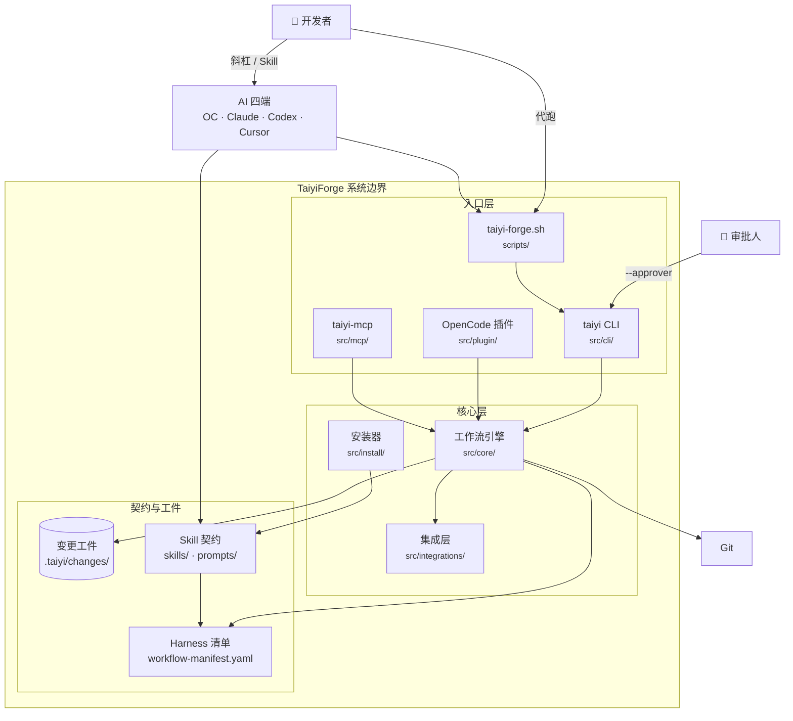

# Container view — oh-my-taiyiforge

> C4 Level 2 · **流水线 Mermaid 真源** · 更新：2026-06-08  
> 下游同步：[`../diagrams/architecture.md`](../diagrams/architecture.md)

> **说明**：Mermaid `C4Container` 在 CLI 渲染时常呈细长竖排、文字重叠；本图用 flowchart 表达同一 Container 语义，PNG 可读性更好。Context 仍用 C4 L1（[`context.md`](context.md)）。

---

## Component（L3）

引擎内部组件图见 [`../diagrams/architecture.md`](../diagrams/architecture.md) §1（不在此重复维护）。

---

## 容器 ↔ 路径对照

| 容器 | 路径 |
|------|------|
| taiyi CLI | `src/cli/taiyi.ts` |
| taiyi-forge.sh | `scripts/taiyi-forge.sh` |
| OpenCode 插件 | `src/plugin/index.ts`, `handlers.ts` |
| taiyi-mcp | `src/mcp/server.ts`, `state-tools.ts`, `lsp-tools.ts` |
| 工作流引擎 | `src/core/workflow-engine.ts` + 子目录 |
| 安装器 | `src/install/run.ts` + `sync-*.ts` |
| 集成层 | `src/integrations/*.ts` |
| 变更工件 | `.taiyi/changes/<slug>/` |
| Skill 契约 | `skills/taiyi-*/`, `prompts/taiyi-*.md` |
| Harness 清单 | `docs/taiyi/workflow-manifest.yaml` |

---

## Traceability

| C4 元素 | Observed 来源 |
|---------|---------------|
| cli | `package.json` `bin.taiyi` |
| plugin | `package.json` `main` → `dist/plugin/index.js` |
| engine | `src/core/` 目录（122+ TS 模块） |
| gates | `src/core/gates/*.ts` |
| artifacts | `AGENTS.md`、`.taiyi/changes/<slug>/` |
| skills | `skills/` 23 个 `taiyi-*` SKILL.md |
