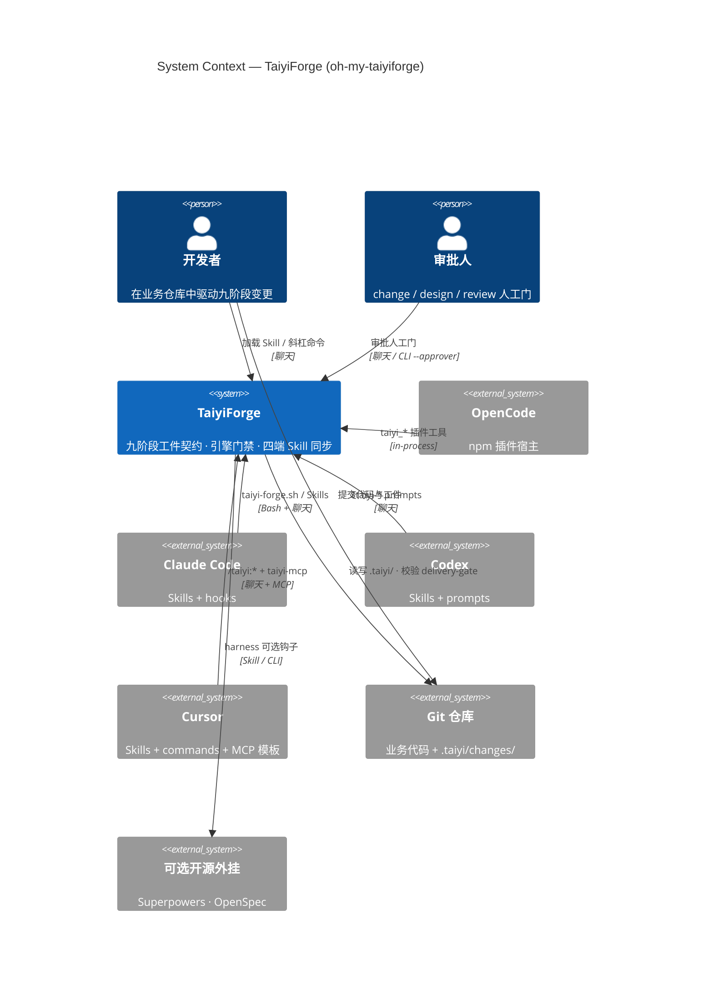

# System Context — oh-my-taiyiforge

> C4 Level 1 · 更新：2026-06-08

## Notes

- TaiyiForge **不是**用户业务应用；它是安装在开发者工作区中的**工作流引擎 + Skill 包**。
- 四端为 **外部系统**（不同 AI IDE/CLI），通过统一契约 `skills/`、`prompts/`、`scripts/taiyi-forge.sh` 对齐。
