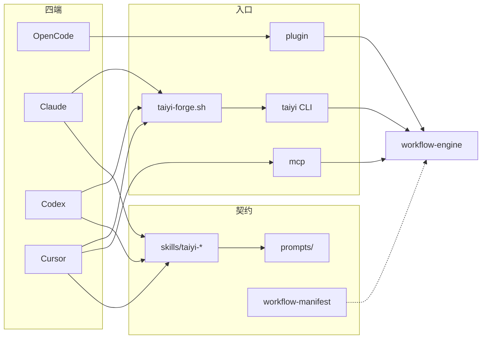
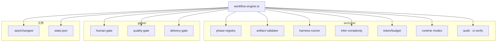
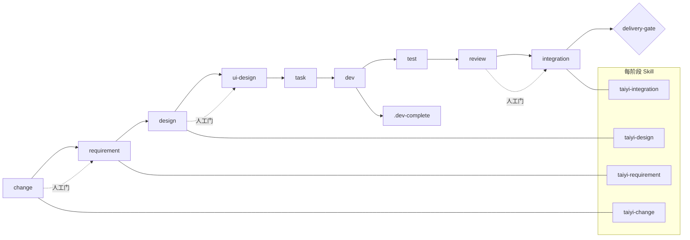
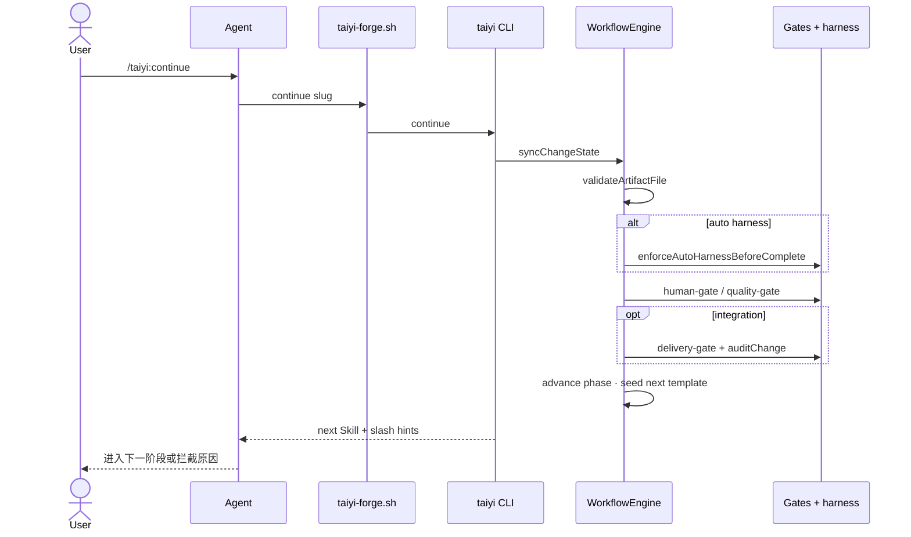
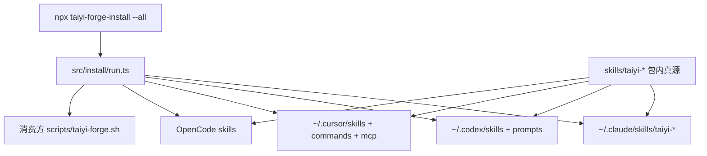

# oh-my-taiyiforge 技术架构图

> C4 真源：[`../c4/containers.md`](../c4/containers.md) · Context：[`../c4/context.md`](../c4/context.md) · 证据说明：[`../c4/README.md`](../c4/README.md)  
> **产品全景海报**（Flow-X）：[`../taiyiforge-architecture.svg`](../taiyiforge-architecture.svg) · [`../taiyiforge-architecture.png`](../taiyiforge-architecture.png)  
> **流水线**：[`pipeline.md`](pipeline.md) · C4 预览 SVG：[`../c4/png/`](../c4/png/)  
> **视觉架构稿**：[`visual/taiyiforge-architecture-ai-4k.png`](visual/taiyiforge-architecture-ai-4k.png)（4K · gpt-image-2）· [`visual/taiyiforge-architecture-ai.png`](visual/taiyiforge-architecture-ai.png) · [`visual/architecture-vercel-mesh.png`](visual/architecture-vercel-mesh.png)  
> 源文件：[`architecture-vercel-mesh.html`](visual/architecture-vercel-mesh.html) · [`architecture-poster.html`](visual/architecture-poster.html)  
> 重生成海报：`python3 scripts/generate-architecture-svg.py` · 重导 PNG：`node scripts/capture-poster.mjs <url> <out.png>`

更新：2026-06-08 · 本文只维护 **工程补充图**；C4 L1/L2 不重复，见 `docs/c4/`

---

## 0. C4 图（真源在 docs/c4/，此处仅链接）

| 层级 | 编辑真源 | 预览（SVG） |
|------|----------|-------------|
| L1 System Context | [`../c4/context.md`](../c4/context.md) | [`../c4/png/context.svg`](../c4/png/context.svg) |
| L2 Container | [`../c4/containers.md`](../c4/containers.md) | [`../c4/png/containers.svg`](../c4/png/containers.svg) |
| 证据说明 | [`../c4/README.md`](../c4/README.md) | — |

---

## 1. 分层组件图（C4 L3 · 拆分为两张）

> 单图节点过多会糊，故拆分；Container 总览见 [`../c4/containers.md`](../c4/containers.md)。

### 1a 四端 · 入口 · 契约

### 1b 引擎 · 门禁 · 工件

---

## 2. 九阶段推进（引擎状态机）

Profile：`api` 跳过 ui-design · `lite` 跳过 design / ui-design / task / review。流程详图见 [`flows.md`](flows.md)。

---

## 3. `/taiyi:continue` 序列（complete 路径）

Agent **写工件**；引擎 **校验 + 推进**（双轨，见 `AGENTS.md`）。

---

## 4. 安装与 Skill 同步

---

## 5. 架构文档地图

| 文档 | 层级 | 用途 |
|------|------|------|
| [`../c4/README.md`](../c4/README.md) | 证据 | Observed / Inferred · Open questions |
| [`../c4/context.md`](../c4/context.md) | C4 L1 | 系统上下文 |
| [`../c4/containers.md`](../c4/containers.md) | C4 L2 | **Mermaid 真源** |
| 本文 | L3 + 时序 | 工程补充（不重复 c4 Mermaid） |
| [`flows.md`](flows.md) | 流程 | 九阶段 · 门禁 · harness |
| [`../taiyiforge-architecture.png`](../taiyiforge-architecture.png) | 海报 | 对外产品全景 |
| [`../ARCHITECTURE.md`](../ARCHITECTURE.md) | 表格 | 能力索引 |

---

## 6. 关键路径索引

| 节点 | 路径 |
|------|------|
| 工作流真源 | `docs/taiyi/workflow-manifest.yaml` |
| C4 流水线 | `docs/diagrams/pipeline.md` |
| 阶段注册 | `src/core/phase-registry.ts` |
| 工件校验 | `src/core/artifact-validator.ts` |
| 辅助 Skill 检测 | `src/core/auxiliary-artifacts.ts` |
| OpenCode 工具 | `src/plugin/handlers.ts` |
| 架构 Skill | `skills/taiyi-diagram-{c4,arch,render,pipeline}/` |
| 流程图 | `docs/diagrams/flows.md` |
