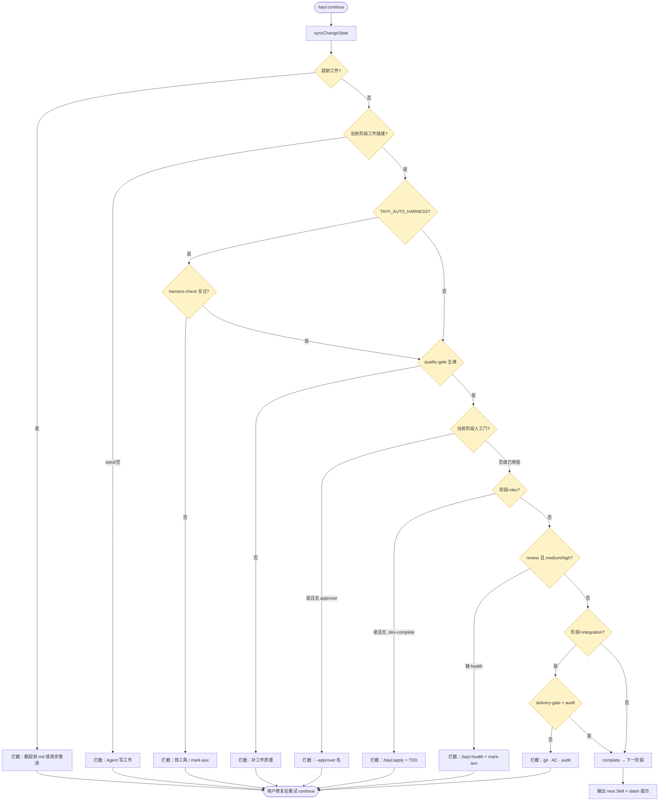

# flow-continue-gates：`/taiyi:continue` 决策树

> 上级索引：[flows.md](./flows.md)

```mermaid
flowchart TD
  enter([/taiyi:continue]) --> sync[syncChangeState]
  sync --> ahead{超前工件?}
  ahead -->|是| blockAhead[拦截：删超前 md 或按步推进]
  ahead -->|否| art{当前阶段工件就绪?}

  art -->|seed/空| blockArt[拦截：Agent 写工件]
  art -->|是| auto{TAIYI_AUTO_HARNESS?}

  auto -->|是| harness{harness-check 全过?}
  harness -->|否| blockHar[拦截：铁三角 / mark-aux]
  harness -->|是| qg
  auto -->|否| qg{quality-gate 五维}

  qg -->|否| blockQ[拦截：补工件质量]
  qg -->|是| human{当前阶段人工门?}

  human -->|是且无 approver| blockH[拦截：--approver 名]
  human -->|否或已审批| devGate{阶段=dev?}

  devGate -->|是且无 .dev-complete| blockDev[拦截：/taiyi:apply + TDD]
  devGate -->|否| revAux{review 且 medium/high?}

  revAux -->|缺 health| blockHealth[拦截：/taiyi:health + mark-aux]
  revAux -->|否| intPhase{阶段=integration?}

  intPhase -->|是| del{delivery-gate + audit}
  del -->|否| blockDel[拦截：git · AC · audit]
  del -->|是| ok
  intPhase -->|否| ok[complete → 下一阶段]

  ok --> next[输出 next Skill + slash 提示]
  blockAhead & blockArt & blockHar & blockQ & blockH & blockDev & blockHealth & blockDel --> retry([用户修复后重试 continue])

  classDef gate fill:#fef3c7,stroke:#ca8a04
  class ahead,art,auto,harness,qg,human,devGate,revAux,intPhase,del gate
```

实现参考：`src/core/workflow-engine.ts` · `src/core/harness-runner.ts` · `src/core/gates/*`
