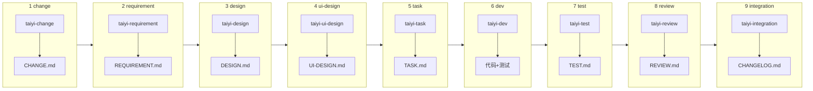
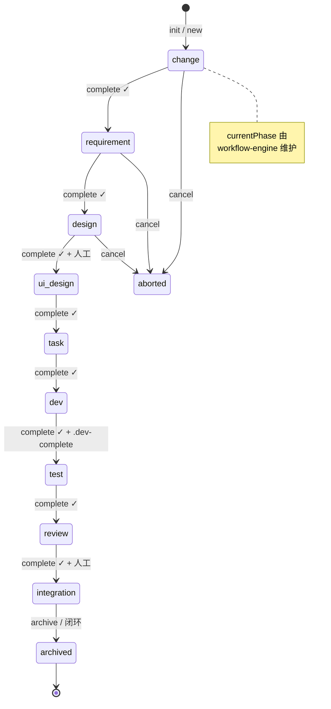
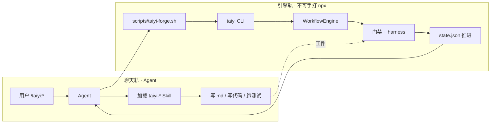

# oh-my-taiyiforge 流程图

> **组件/模块架构**（谁依赖谁）→ [`architecture.md`](./architecture.md) · **产品海报** → [`../taiyiforge-architecture.png`](../taiyiforge-architecture.png)  
> 导出 PNG：`node scripts/render-mermaid.mjs docs/diagrams/flows.md`

更新：2026-06-08 · 真源：`docs/taiyi/workflow-manifest.yaml`

---

## 1. 开发者主路径（从立项到归档）

```mermaid
flowchart TD
  start([开始]) --> install{npx taiyi-forge-install?}
  install -->|否| instFail[安装四端 Skills + 脚本]
  install -->|是| new
  instFail --> new

  new["/taiyi:new 标题"] --> change["阶段1 change<br/>taiyi-change → CHANGE.md"]
  change --> hg1{人工门?}
  hg1 -->|change complete + approver| req["阶段2 requirement"]
  hg1 -->|拦截| fixC[补 CHANGE / explore]

  req --> des["阶段3 design"]
  des --> hg2{人工门?}
  hg2 -->|approver| ui["阶段4 ui-design"]
  hg2 -->|拦截| fixD[补 DESIGN / diagram]

  ui --> task["阶段5 task"]
  task --> dev["阶段6 dev<br/>TDD + .dev-complete"]
  dev --> test["阶段7 test"]
  test --> rev["阶段8 review"]
  rev --> hg3{人工门?}
  hg3 -->|approver| int["阶段9 integration"]
  hg3 -->|拦截| fixR[改代码 / health]

  int --> dg{delivery-gate}
  dg -->|通过| arch["/taiyi:archive"]
  dg -->|失败| fixI[audit · git 干净 · AC]
  arch --> end([变更闭环])

  fixC --> change
  fixD --> des
  fixR --> dev
  fixI --> int

  classDef gate fill:#fef3c7,stroke:#ca8a04,color:#422006
  class hg1,hg2,hg3,dg,install gate
```

Profile 分支（未展开）：`api` 跳过 ui-design · `lite` 跳过 design / ui-design / task / review。

---

## 2. 九阶段 + Skill + 工件（full profile）



辅助工件（按需，不阻塞主线）：`CONTEXT.md` · `adr/` · `diagrams/` · `health-report.md` · `architecture-sync.md`

---

## 3. 变更状态机（state.json）



---

## 4. 双轨执行（聊天 vs 引擎）



---

## 5. 子流程索引

| 流程 | 文件 | 说明 |
|------|------|------|
| `/taiyi:continue` 门禁决策树 | [flow-continue-gates.md](./flow-continue-gates.md) | 含失败分支 |
| `--auto` 全自动编排 | [flow-auto-orchestrator.md](./flow-auto-orchestrator.md) | orchestrator + harness |

---

## 6. Traceability（本仓库文档）

| 流程节点 | 文档 / 代码 |
|----------|-------------|
| 九阶段顺序 | `docs/taiyi/workflow-manifest.yaml` |
| 斜杠命令 | `docs/taiyi/commands.yaml` |
| 人工门 | `src/core/gates/human-gate-config.ts` |
| 质量五维 | `docs/taiyi/quality-gate.yaml` |
| delivery-gate | `src/core/gates/delivery-gate.ts` |
| continue 实现 | `src/core/workflow-engine.ts` |
| 验证套件 | `examples/verification-suite/run-all.mjs` |

---

## 7. 与架构流水线 / diagram-arch 的分工

| 命令 | 产出 | 回答的问题 |
|------|------|------------|
| `/taiyi:diagram-pipeline` | `c4/` + `architecture.md` + `png/` | **一条链**：C4 真源 → 工程图 → PNG |
| `/taiyi:diagram-c4` | `c4/containers.md` | 代码反推模块边界（Observed/Inferred） |
| `/taiyi:diagram-arch` | `architecture.md` | **模块**有哪些、怎么连（同步自 c4） |
| `/taiyi:diagram-render` | `c4/png/*.svg` | C4 Mermaid → SVG |
| `/taiyi:diagram-flow` | `flows.md`（本文） | **步骤**怎么走、何时被门禁拦住 |

详见 [`pipeline.md`](pipeline.md)。产品海报：`docs/taiyiforge-architecture.png`。
