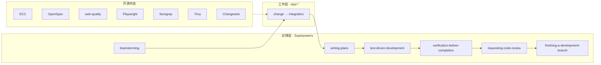

# 完整开源流程（Superpowers + ECC 双线 harness）

> **何时读本文**：需要 **ECC + OpenSpec + Playwright + 安全扫描 + Changesets** 全链演示或 dogfood 时。日常开发 → [full-oss-flow.md §superpowers](#superpowers-主轴) · 命令索引 → [canonical-commands.md](./canonical-commands.md)。

> **GStack 已移除** — 架构审查/代码审查/QA/发布职能已由 ECC 双线 harness 承接。详见 [library-selection.md](./library-selection.md)。

> **一条链跑通**：九阶段 × Superpowers 14 技能 × ECC × OpenSpec × web-quality × Playwright × Semgrep × Trivy × Changesets × taiyi 辅助 Skill。  
> **分域真源**：[`workflow-manifest.yaml`](./workflow-manifest.yaml)（harness / Superpowers 目录）· [`phases.yaml`](./phases.yaml)（九阶段 DAG）· [`builtin-profiles.ts`](../../src/core/builtin-profiles.ts)（Profile skip）· [`artifact-contract.md`](./artifact-contract.md)（json+hbs+md）· 本页（人类剧本）

## 前置安装

```bash
npx taiyi-forge-install --all          # Superpowers · OpenSpec · web-quality-skills
npx taiyi doctor

# 按项目需要（完整流程建议全装）
npm i -D vitest @playwright/test @changesets/cli
pip install semgrep   # 或 brew install semgrep
brew install trivy    # 可选
```

聊天入口：`/taiyi:full-flow` · 引擎：`scripts/taiyi-forge.sh harness <slug>`

---

## 总览



每阶段微循环：**加载 Skill → 写工件 → harness-check 打卡 → /taiyi:continue（或 apply）**

---

## 九阶段完整串联

### ① change — 立项

| 顺序 | 做什么 | 工具 |
|------|--------|------|
| 1 | 头脑风暴澄清 | Superpowers `brainstorming` → `/taiyi:explore` |
| 2 | 代码库情报（可选） | `taiyi-intel-scan` → `CONTEXT.md` |
| 3 | 写变更提案 | `taiyi-change` → `change.json` → `render` → `CHANGE.md` |
| 4 | 打卡 | `harness-check superpowers/brainstorming` |
| 5 | 过关 | `/taiyi:continue` |

### ② requirement — 需求

| 顺序 | 做什么 | 工具 |
|------|--------|------|
| 1 | 写可执行计划（建议） | Superpowers `writing-plans` |
| 2 | 对照 OpenSpec（可选） | `openspec change show <slug>` |
| 3 | 写需求与 AC | `taiyi-requirement` → `requirement.json` → `render` → `REQUIREMENT.md` |
| 4 | 过关 | `/taiyi:continue` |

### ③ design — 技术设计

| 顺序 | 做什么 | 工具 |
|------|--------|------|
| 1 | 架构决策（medium+） | `taiyi-architect` → `adr/` |
| 2 | 写 DESIGN ≥2 方案 | `taiyi-design` → `design.json` → `render` → `DESIGN.md` |
| 3 | 工程评审 | ECC `architecture-audit` |
| 4 | 打卡 | `harness-check ecc/architecture-audit` |
| 5 | 过关 | `/taiyi:continue` |

### ④ ui-design — 交互与无障碍

| 顺序 | 做什么 | 工具 |
|------|--------|------|
| 1 | 写 UI 契约 | `taiyi-ui-design` → `ui-design.json` → `render` → `UI-DESIGN.md` |
| 2 | 设计计划评审（有 UI） | ECC `web-design-guidelines` |
| 3 | 无障碍 | web-quality `accessibility` |
| 4 | 设计规范 | web-quality `web-design-guidelines` |
| 5 | 视觉任务（可选） | `taiyi-restyle` → `ui-restyle-tasks.md` |
| 6 | 打卡（有 UI 时） | 上表 ECC/web-quality 各项 |
| 7 | 过关 | `/taiyi:continue` |

纯 API/CLI 项目：ui-design 可标 N/A，跳过 web-quality 打卡。

### ⑤ task — 任务切片

| 顺序 | 做什么 | 工具 |
|------|--------|------|
| 1 | TDD 计划 | `/taiyi:tdd plan` → `writing-plans` + `test-driven-development` |
| 2 | 写 TASK | `taiyi-task` → `task.json` → `render` → `TASK.md` |
| 3 | 打卡 | `harness-check superpowers/writing-plans` · `superpowers/test-driven-development` |
| 4 | 过关 | `/taiyi:continue` |

### ⑥ dev — TDD 实现

| 顺序 | 做什么 | 工具 |
|------|--------|------|
| 1 | 红绿重构 | `/taiyi:tdd dev` → `test-driven-development` |
| 2 | 大功能（可选） | `subagent-driven-development` · `dispatching-parallel-agents` · `using-git-worktrees` |
| 3 | 实现代码 | `taiyi-dev` · `/taiyi:apply` |
| 4 | 跑测试 | `npm test` → `.dev-complete`（须 `exitCode: 0`） |
| 5 | 打卡 | `harness-check superpowers/test-driven-development` |
| 6 | 过关 | `/taiyi:continue` |

### ⑦ test — 测试与验证

| 顺序 | 做什么 | 工具 |
|------|--------|------|
| 1 | 证据先于完成 | Superpowers `verification-before-completion` |
| 2 | 单测/集成 | Vitest/Jest `npm test` |
| 3 | E2E（有 Web） | `npx playwright test` |
| 4 | 站点 QA（有 Web） | Playwright E2E |
| 5 | 无障碍复验 | web-quality `accessibility` |
| 6 | 写 TEST | `taiyi-test` → `test.json` → `render` → `TEST.md` |
| 7 | 架构同步（可选） | `taiyi-evolve` → `architecture-sync.md` |
| 8 | 打卡 | verification · qa · playwright（按项目） |
| 9 | 过关 | `/taiyi:apply` 或 `/taiyi:continue` |

### ⑧ review — 代码审查与安全

| 顺序 | 做什么 | 工具 |
|------|--------|------|
| 1 | 健康基线（medium/high） | `/taiyi:health` → `taiyi-health` → `health-report.md` |
| 2 | 派审循环 | `/taiyi:review-loop` → `requesting-code-review` |
| 3 | PR 结构审查 | ECC `code-review` |
| 4 | SAST | `semgrep scan --config auto` |
| 5 | 漏洞扫描 | `trivy fs .` |
| 6 | 写 REVIEW | `taiyi-review` → `review.json` → `render` → `REVIEW.md` |
| 7 | 打卡 | superpowers/review 必选 · ECC security-scan 按项目 |
| 8 | 过关 | `/taiyi:continue --approver` |

### ⑨ integration — 交付闭环

| 顺序 | 做什么 | 工具 |
|------|--------|------|
| 1 | 分支收尾 | Superpowers `finishing-a-development-branch` |
| 2 | 再次验证 | `verification-before-completion` |
| 3 | 提交代码 | `git commit`（交付门） |
| 4 | 文档发布 | ECC `changelog-generator` |
| 5 | 版本（monorepo） | Changesets `npx changeset version` |
| 6 | 写 integration 工件 | `taiyi-integration` → `integration.json` → `render` → 变更目录 `CHANGELOG.md` |
| 7 | 交付预检 | `/taiyi:audit` |
| 8 | 打卡 | finishing-a-development-branch · verification · document-release |
| 9 | 过关 | `/taiyi:continue` |

### ⑩ archive — 归档

| 顺序 | 做什么 | 工具 |
|------|--------|------|
| 1 | 同步 OpenSpec | `taiyi sync-openspec` 或引擎自动 |
| 2 | 归档 | `/taiyi:archive` · `openspec archive` |
| 3 | 架构演进（可选） | `taiyi-evolve` |

---

## 全自动模式（--auto）

加载 **`taiyi-orchestrator`**，每阶段：

```text
harness <slug>           # 看 §1 双线 harness + §2 辅助 + §3 主 Skill
→ 逐项加载并执行
→ harness-check 每项（必选必打，可选建议打）
→ continue <phase>   # 聊天 /taiyi:continue；CLI 别名 complete
→ 重复至 integration
```

或 `/taiyi:continue xN` 循环推进。

---

## harness 打卡速查（完整版）

| 阶段 | 必选打卡 | 建议打卡（完整流程） |
|------|----------|----------------------|
| change | superpowers/brainstorming | taiyi-intel-scan |
| requirement | — | superpowers/writing-plans · openspec |
| design | — | ecc/architecture-audit · taiyi-architect |
| ui-design | — | ecc/web-design-guidelines · web-quality/* |
| task | writing-plans · test-driven-development | — |
| dev | test-driven-development | subagent/parallel/worktrees |
| test | verification-before-completion | Playwright E2E · web-quality |
| review | requesting-code-review | ecc/code-review · security-scan · taiyi-health |
| integration | finishing-a-development-branch · verification | openspec · changesets |

---

## 示例脚本

```bash
cd oh-my-taiyiforge/examples/full-oss-flow
node scripts/run-full-oss-flow.mjs
```

对照逐步输出与 `harness` 清单，验证引擎可串联全部钩子。

---

## 相关

- [full-oss-flow.md §superpowers](#superpowers-主轴) — Superpowers 主轴摘要
- [integrations.md](./integrations.md) — 双线 harness 集成安装
- [full-oss-flow.md §TDD](#tdd-门禁) — dev 门禁
- [delivery-gate.md](./delivery-gate.md) — integration 交付门
