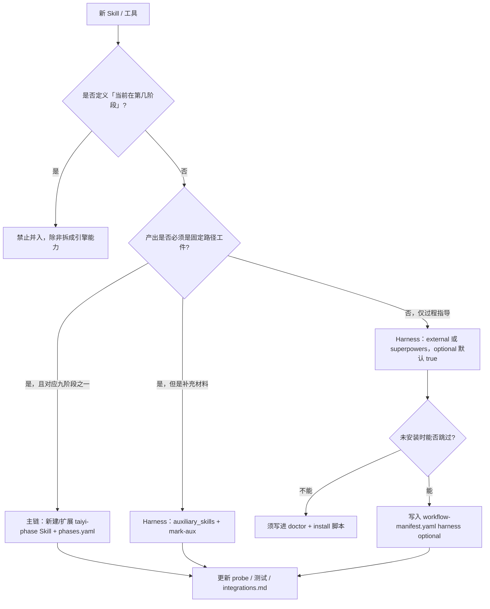

# TaiyiForge Skill 融合原则

> **何时读本文**：要把市面 Skill（Superpowers、gstack、自建、第三方）接进 TaiyiForge 时；或评审「这个 Skill 该不该进主链」时。  
> **单一真源（机器可读）**：[`workflow-manifest.yaml`](./workflow-manifest.yaml) · [`phases.yaml`](./phases.yaml)  
> **铁三角映射表**：[`integrations.md`](./integrations.md) · [`superpowers-flow.md`](./superpowers-flow.md)

---

## 1. 我们要解决什么问题

TaiyiForge 的目标不是再做一个「Skill 大全」，而是：

**用同一套阶段状态机 + 工件契约，编排市面上最好的专项 Skill。**

融合成功 = 用户换 Skill、换 Agent、换端（OpenCode / Claude / Codex / Cursor），**`.taiyi/changes/<slug>/` 里的进度与门禁仍然可信**。

---

## 2. 三层分类（总览）

| 层级 | 是什么 | 谁推进阶段 | 典型例子 |
|------|--------|------------|----------|
| **主链（Main chain）** | 九阶段 + 引擎控制面 | **只有引擎**（`continue` / `complete`） | `taiyi-change` … `taiyi-integration`、`taiyi-forge` |
| **Harness（外挂）** | 阶段内「怎么做更好」 | 聊天加载 Skill；**不得**替代 `continue` | Superpowers TDD、gstack `/review`、`taiyi-health` |
| **禁止（Forbidden）** | 破坏契约、越权、不可审计 | — | 跳过阶段、无工件过关、让用户手打引擎 shell |

```text
用户意图
    │
    ▼
┌─────────────────────────────────────┐
│  主链：写工件 + 引擎过关              │  ← 唯一可以改变 currentPhase 的路径
└─────────────────────────────────────┘
    │ 阶段内
    ▼
┌─────────────────────────────────────┐
│  Harness：专项 Skill 提升质量         │  ← 产出须落盘或 mark-aux，optional/required 由 manifest 定
└─────────────────────────────────────┘
    │
    ▼
  禁止层：任何绕过工件 / 门禁 / 审批的行为
```

---

## 3. 什么能进主链

主链成员 **必须同时满足** 下列全部条件。

### 3.1 准入条件

1. **一阶段一职责** — 对应 `phases.yaml` 中唯一 `id`，且只负责该阶段 **主工件**（或 dev 的 code bundle）。
2. **可落盘契约** — 输出路径固定 under `.taiyi/changes/<slug>/`（见 [`artifact-layout.md`](./artifact-layout.md)）。
3. **可机器校验** — 过关前能通过 artifact-validator + quality-gate 五维（[`quality-gate.yaml`](./quality-gate.yaml)）。
4. **不调用外部 LLM 作为过关依据** — 「完成」由引擎 + 规则判定；Skill 正文只指导 **如何写工件**。
5. **前缀与分发** — 仓库内 `skills/taiyi-*`，经 `taiyi-forge-install` 同步四端；命名稳定，不随第三方版本漂移。

### 3.2 主链成员清单（当前）

| 类型 | Skill / 入口 | 说明 |
|------|--------------|------|
| 九阶段 | `taiyi-change` … `taiyi-integration` | 写 CHANGE … CHANGELOG |
| 引擎控制面 | `taiyi-forge` | Agent **代跑** `taiyi-forge.sh`，禁止让用户手打 |
| 全自动编排 | `taiyi-orchestrator` | `--auto` 时读 harness 清单，**不**替代 complete |
| 交付辅助（仍非阶段） | `taiyi-ultrawork` 等 | 仅当文档明确为「控制面/编排」，且不进 `phases.yaml` |

### 3.3 主链 ≠ 「最重要的 Skill」

gstack `/ship`、Superpowers TDD **再好用也不进主链** — 它们不负责阶段状态，只负责 **阶段内质量**。  
主链回答：「现在在第几阶段、缺什么工件、能不能 continue？」

---

## 4. 什么只能做 Harness

Harness Skill **增强**某一阶段，但 **不能** 声明阶段已完成。

### 4.1 准入条件

1. **绑定阶段** — 在 `workflow-manifest.yaml` 的 `phases.<id>.harness` 或 `auxiliary_skills` 中有记录。
2. **输出可审计** — 至少其一：
   - 写入 `.taiyi/changes/<slug>/` 下 **约定文件名**（如 `health-report.md`、`CONTEXT.md`）；
   - 或 `mark-aux <slug> <key>` 打卡（auto 模式可强制）。
3. **可选 vs 必选** — 必须显式 `optional: true/false`；必选项缺失时 **complete 阻塞**，而不是静默跳过。
4. **聊天内加载** — Superpowers / gstack 用 Skill 工具或斜杠；**不** fork 成第二个状态机。
5. **可降级** — 未安装依赖时引擎跳过（`doctor` 报 WARN，不拖死主链），见 [`integrations.md`](./integrations.md)。

### 4.2 四类 Harness（推荐用法）

| 类别 | 来源 | 角色 | 示例 |
|------|------|------|------|
| **纪律层** | Superpowers | 方法论：TDD、验证、CR | `test-driven-development`、`verification-before-completion` |
| **闭环层** | gstack | 评审 / QA / 发版 | `plan-eng-review`、`review`、`document-release` |
| **规范层** | OpenSpec | 可选镜像 / 归档 | `openspec change show`、`taiyi archive` |
| **Taiyi 辅助** | 本仓库 `taiyi-*`（非九阶段） | 落盘扩展工件 | `taiyi-health`、`taiyi-intel-scan`、`taiyi-compress` |

### 4.3 Harness 铁律

| 允许 | 禁止 |
|------|------|
| 在 dev 阶段用 TDD Skill 写测试与实现 | 在 change 阶段直接改 `src/` 业务代码（规划期只写 `.taiyi/` 工件） |
| review 前跑 gstack `/review` 写进 REVIEW.md | 用 `/ship` **代替** `/taiyi:continue review` |
| integration 前 `/taiyi:commit` + delivery gate | 无 commit、无 trailer 强行 complete integration |
| `mark-aux` 记录辅助 Skill 已完成 | 只在聊天里说「我 review 过了」而不落盘 |

### 4.4 auto 模式（`init --auto`）下的 Harness

`--auto` 时，manifest 里 **未标 `optional: true`** 的 harness 项会在 complete 前被检查（`harness-check` / `taiyi:check`）。  
新增 Harness 默认应为 **optional**；升为必选须更新 manifest + 文档 + probe/测试。

---

## 5. 什么禁止

以下行为 **一律不允许** 进入官方融合清单（即使用户本地私自用，也不写入 TaiyiForge 文档或 manifest）。

### 5.1 流程越权

| 禁止项 | 原因 | 正确做法 |
|--------|------|----------|
| 跳过阶段或并行写多阶段主工件 | 破坏依赖 DAG | 按 `phases.yaml` 顺序；profile `lite/api` 仅 **跳过整阶段**，不跳中间 |
| 用聊天结论替代 `complete` / `continue` | 无 state.json 真源 | Agent 代跑 `taiyi-forge.sh continue <slug>` |
| 让用户手打 `npx taiyi` / `taiyi-forge`（非 CI） | DX 与 probe 一致性问题 | 加载 `taiyi-forge` Skill 或 OpenCode 工具 |
| 多个 active slug 无指定继续 | 状态歧义 | `list` + 显式 slug |

### 5.2 契约破坏

| 禁止项 | 原因 |
|--------|------|
| 主工件只存在于聊天、不写入 `.taiyi/changes/` | 不可 CI verify、不可 handoff |
| 修改他 slug 目录下工件 | 变更隔离 |
| 在 change…task 阶段改业务代码（非 strict-dev 例外） | 规划/实现混 phase；见 dev 门禁 |
| 伪造 `.dev-complete` / 质量门禁字段 | 审计与 delivery gate 失效 |

### 5.3 不可信或不可维护的 Skill

| 禁止项 | 原因 |
|--------|------|
| 无版本、无仓库、一次性 prompt 包 | 无法 doctor / 无法 pin |
| 要求上传密钥、代码到第三方才能「过关」 | 安全与离线 CI |
| 与主链抢「完成」定义（Skill 内自带 phase 状态机） | 双状态机必 drift |
| 在 manifest 中复制整份外部 Skill 正文 | 维护地狱；用 **引用 + harness 一行** |

### 5.4 交付与 Git 纪律（integration 前）

| 禁止项 | 正确做法 |
|--------|----------|
| 无测试证据声明 test 完成 | TEST.md + `verification-before-completion` |
| 无 PR/Review 声明 review 完成 | REVIEW.md + 可选 gstack review |
| integration 时工作区脏、无 Taiyi-Change trailer（默认开启时） | [`delivery-gate.md`](./delivery-gate.md) · `/taiyi:commit` |

---

## 6. 新 Skill 接入决策树



---

## 7. 新 Skill 接入 Checklist

接入 **Harness**（最常见）：

- [ ] 在 [`workflow-manifest.yaml`](./workflow-manifest.yaml) 增加 `harness` 或 `auxiliary_skills` 条目（`phases`、`optional`、`when` 说明）
- [ ] 约定 artifact 路径或 `mark-aux` key
- [ ] 更新 [`integrations.md`](./integrations.md) 映射表一行
- [ ] `taiyi doctor` 能检测依赖是否安装（可选依赖 → WARN 非 FAIL）
- [ ] 若 `--auto` 必选：加 `harness-check` 测试或 probe 用例
- [ ] **不要**复制 Skill 全文进仓库；写「加载方式 + 产出路径」即可

接入 **主链**（极少，需 ADR 级理由）：

- [ ] 更新 [`phases.yaml`](./phases.yaml) + manifest `phases` 块
- [ ] 新增 `skills/taiyi-<phase>/SKILL.md` + 模板 under `templates/`
- [ ] artifact-validator + quality-gate 规则
- [ ] E2E / dogfood 能跑通新阶段顺序
- [ ] profile（lite/api/full）明确 skip 行为

---

## 8. Profile 与融合深度

| Profile | 主链 | Harness 深度 |
|---------|------|----------------|
| **full** | 九阶段全开 | Superpowers 必选 + gstack 建议 + 辅助 Skill 按复杂度 |
| **api** | 跳过 ui-design | 后端向 harness；UI 类 optional |
| **lite** | 跳过 design / ui-design / task / review | 仅保留 change → requirement → dev → test → integration 核心纪律 |

**原则**：profile 只 **删阶段或降级 harness 必选性**，不发明平行流程。

---

## 9. 与 OMX / 其他编排器并存

| 组件 | 分工 |
|------|------|
| **OMX / 多 Agent 编排** | 谁去做、并行几路、模型路由 |
| **TaiyiForge** | 做什么阶段、工件是否齐、能否 continue |
| **gstack / Superpowers** | 怎么做这一步最好 |

**禁止**：OMX 团队 pipeline **直接 complete 阶段**而不写工件 — 须回调 TaiyiForge 引擎或等价 OpenCode 工具。

---

## 10. 一句话记忆

- **主链**：阶段 + 工件 + 引擎 — **唯一真相**
- **Harness**：市面最好 Skill — **可插拔、可打卡、可跳过**
- **禁止**：跳过、双状态机、聊天即完成、无落盘

---

## 相关文档

- [canonical-commands.md](./canonical-commands.md) — **v28 推荐顶栏** + legacy 映射
- [integrations.md](./integrations.md) — 铁三角安装与阶段映射
- [invoke.yaml](./invoke.yaml) — 双轨调用（聊天 vs 引擎）
- [control-plane.md](./control-plane.md) — Agent 纪律  
- [delivery-slash.md](./delivery-slash.md) — commit / ship / land 与阶段边界  
- [probe-triage.md](./probe-triage.md) — 误用探测与 UX 回归
