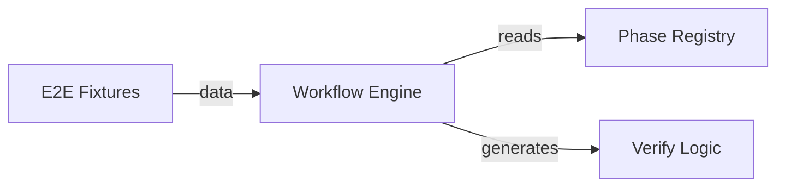

<!-- phase:design skill:taiyi-design gate:human est:30min produces:DESIGN.md upstream:[requirement] downstream:[task,ui-design] cplx:[ALL]4steps +[M+]6 +[H]1 (+opt:1) -->
# DESIGN: E2E Demo

> **一句话**: Node.js + TypeScript + Vitest

---

## Step 1: Context & Constraints
> **[ALL]** Goal: 框定设计边界 | Inputs: REQUIREMENT.md §2, §4, §8
<!-- Action: 技术栈全貌 + 约束条件 -->

- **选定**: Node.js + TypeScript + Vitest
  理由: Consistent with project stack; no new runtime dependencies
- **前端**: N/A (CLI-only change)
- **后端**: Node.js + Commander
- **数据库**: N/A (file-based state)
- **部署**: npm registry / GitHub Actions
- **关键依赖**: handlebars, zod, vitest, commander
- **明确排除**: Docker, Kubernetes (无容器化需求)
- **约束**: _在此列出技术/性能/兼容性/时间/团队约束_

<!-- Validate: 约束覆盖技术/性能/兼容性/时间/团队？ -->

## Step 1a: Current State
> **[ALL]** Goal: 变更前基线，ADR 强制覆写模式 | Inputs: CHANGE.md §1
<!-- Action: 记录变更前的架构/行为状态。ADR 模式：强制覆写 DESIGN.md，不准 append-only -->

**当前架构/行为**:

_待补充变更前的架构/行为快照（如：当前登录模块使用 Session 中间件，无 JWT 支持）_

> ⚠️ **ADR 覆写规则**: 此 DESIGN.md 是当前变更的设计真源，**强制覆写**而非追加。每次设计变更请覆写/更新相关节段，不要保留过时的旧设计 —— 半年后的 Agent 从此文档拼出系统全貌，不看历史版本。变更记录由 CHANGELOG.md 和 git log 承担。

<!-- Validate: 基线状态可度量？下一次变更能从此出发？ -->

## Step 1b: Dependency Sandbox
> **[ALL]** Goal: 每个依赖有版本/用途/替代方案/过时检查 | Inputs: package.json / 项目配置
<!-- Action: 列出所有新增/变更的依赖，标注版本范围、用途、替代方案、npm 最新版 -->

| 依赖 | 版本范围 | 用途 | 考虑过的替代 | npm 最新 | 过时检查 |
|------|---------|------|------------|:-------:|:--------:|
| _待列新增/变更依赖_ | _^X.Y_ | _用途_ | _替代方案(可选)_ | _latest_ | _✅ 已检查_ |

> 💡 写模板时 `npm view <pkg> version` 检查最新版本；若有 major bump 警告需说明。
> SSOT 规则：依赖变更的真源在 `package.json` / lockfile，此表为设计视角的验证清单。

<!-- Validate: 每个依赖有最新版本确认？替代方案已搜索？→如果依赖陈旧则应在此说明已在最近的 minor 上 -->

## Step 2: Architecture Overview
> **[ALL]** Goal: 一眼看清整体结构 | Inputs: Step1+REQUIREMENT.md §2
<!-- Action: Mermaid图 + 模块清单(新增/修改/删除) -->



| 模块 | 操作 | 路径 | 说明 |
|------|------|------|------|
| E2E Fixtures | 新增 | src/core/e2e-fixtures.ts | E2E 测试夹具数据 |
| Workflow Engine | 修改 | src/core/workflow-engine.ts | E2E 流程编排 |
| Phase Registry | 读取 | src/core/phase-registry.ts | 阶段定义与依赖 |
| Verify Logic | 修改 | src/core/run-slash-flow-cli.ts | 验收报告生成 (writeVerifyReport) |

### 既有架构对齐（brownfield）
<!-- Action: 三表 — 触碰模块 / 抽象沿用 / 模式对比 -->

**触碰模块**:
- `src/core/workflow-engine.ts`（既有 · 本次修改）
- `src/core/phase-registry.ts`（既有 · 本次修改）
- `src/core/run-slash-flow-cli.ts`（既有 · 本次修改）
- `src/core/e2e-fixtures.ts`（新增）
**禁动清单**:
- `src/core/types.ts`（AI 不许碰）

<!-- Validate: 禁动清单是否从 CONTEXT 复用？新增模块有没有侵入禁动区？ -->

## Step 3: Options Analysis
> **[ALL]** Goal: ≥2方案含对照 | Inputs: Step1+2
<!-- Action: 每个方案: 思路/优点/缺点/代价。A=不改/最小改动 -->

| 方案 | 名称 | 思路 | 优点 | 缺点 | 代价 |
|------|------|------|------|------|------|
| A | Inline script | Bash 脚本直调 taiyi-forge.sh，手动验证 | Fast<br>Simple<br> | Manual<br>No CI<br> | Low |
| B | Vitest only | Vitest 全量测试含 E2E 夹具，CI 自动回归 | CI<br>Automated<br> | No CLI<br> | Low |

<!-- Validate: ≥2方案？含"不改"对照？代价量化？ -->

## Step 4: Decision
> **[ALL]** Goal: 选定方案并说清理由 | Inputs: Step3
<!-- Action: 基于数据/约束决策，不写"感觉这个好" -->

- **Chosen**: B
- **Reason**: Automated regression in every release.

<!-- Validate: 理由基于数据/约束而非主观？ -->

## Step 5: Detailed Design
> **[MEDIUM+]** Goal: 落地细节完整 | Inputs: Step4
<!-- Action: DDL+API契约+时序图 -->

### 数据模型
```sql
-- 在此处填写数据模型 DDL（如有变更）
```

### API 设计
```
在此处描述 API 变更（如新增 / 修改端点）
```

### 关键流程
_在此处用 Mermaid 时序图描述关键流程（如有）_

<!-- Validate: DDL有索引？API有rate limit？流程有错误路径？ -->

## Step 6: Blast Radius
> **[MEDIUM+]** Goal: 每个决策的最坏情况 | Inputs: Step2+4
<!-- Action: 决策→爆炸半径→最坏情况→隔离措施 -->

| 决策 | 半径 | 最坏情况 | 隔离 |
|------|:--:|---------|------|
| Vitest-based E2E | 低 | E2E 假阳性误拦CI | 独立测试文件，不影响业务代码 |

<!-- Validate: 有没有一个变更能影响所有用户？半径可控？ -->

> 📎 **SSOT 规则**: 风险真源见 [CHANGE.md §Risks](CHANGE.md)。Blast Radius 从架构视角验证已声明的业务风险，不重复定义。

## Step 7: Innovation Token Accounting
> **[MEDIUM+]** Goal: 不浪费创新额度 | Inputs: Step2+5
<!-- Action: 新技术/新Infra必须说明理由。每公司约3token -->

| 决策 | Token? | 不选成熟方案的理由 |
|-----|:--:|-------------------|
| 无新技术 | 否 | 全栈已有技术栈 |

_累计: 1/3_

<!-- Validate: ≤3？每个"是"有充分理由？ -->

## Step 8: Trade-off Analysis
> **[MEDIUM+]** Goal: 诚实面对取舍 | Inputs: Step4+5
<!-- Action: 选择了什么/代价是什么/为什么接受 -->

| 权衡点 | 选择 | 接受理由 |
|--------|------|---------|
| 测试框架选型 | Vitest | 与项目构建工具链一致，零额外依赖 |
| 夹具硬编码 vs 模板渲染 | 模板渲染 | 与真实执行路径一致，避免双轨漂移 |

<!-- Validate: 每个权衡都说清了"接受代价的理由"？ -->

## Step 9: Distribution & Deployment
> **[MEDIUM+]** Goal: 确保能发布 | Inputs: Step5
<!-- Action: 新artifact类型？CI/CD变更？回滚方式？ -->

- **新artifact**: verify-report.json（验收报告）
- **CI/CD变更**: 合并 PR 到 main 分支; CI 自动运行全量测试（含 E2E）; npm publish（含语义化版本号）; 运行 npm run check:docs 确保命令表与文档同步
- **回滚方式**: E2E 测试持续失败 (>2 次重试) 或 verify-report 出现 error

<!-- Validate: 新artifact的build/publish/update流程完整？ -->

## Step 10: Security Model
> **[HIGH]** Goal: 威胁建模仿真 | Inputs: Step5+REQUIREMENT.md §9
<!-- Action: STRIDE威胁建模+缓解 -->

| 威胁 | 攻击向量 | 缓解 |
|------|---------|------|
| Spoofing | 伪造 CLI 参数 | Commander 参数校验 |
| Tampering | 篡改 state.json | SHA256 hash 快照校验 |

<!-- Validate: OWASP Top10全覆盖？敏感数据加密+日志脱敏？ -->

> 📎 **SSOT 规则**: 安全策略真源见 [CHANGE.md §Risks](CHANGE.md) + [REQUIREMENT.md §Non-Functional Security](REQUIREMENT.md)。STRIDE 威胁建模从此派生，不独立重评估。

## Step 11: Rollout Strategy
> **[MEDIUM+]** Goal: 上线有计划 | Inputs: Step6+9
<!-- Action: 灰度比例+观察时间+回滚触发 -->

- 合并 PR 到 main 分支
- CI 自动运行全量测试（含 E2E）
- npm publish（含语义化版本号）
- 运行 npm run check:docs 确保命令表与文档同步

> 📎 **SSOT 规则**: 回滚真源见 [CHANGE.md §Risks](CHANGE.md)。此处为部署视角的灰度/上线步骤，与 CHANGE 的 rollback_{trigger,ops,time} 互不重复。若此处的回滚方式 != CHANGE 声明的，即视为 SSOT 违规。

## Step 12: Architecture Evolution
- [reusable-abstraction] Extract E2E fixture pattern to shared test-utils

---
## Quality Gate
<!-- Evidence-first: 每项通过需要可验证证据，不是"感觉对了"。Superpowers verification-before-completion -->

- [ ] S1 约束完整
- [ ] S2 架构图+模块清单清晰
- [ ] S3 ≥2方案含对照
- [ ] S4 决策基于数据
- [ ] [M+] S5 含DDL+API+流程
- [ ] [M+] S6 Blast Radius已评估
- [ ] [M+] S7 Token≤3
- [ ] [M+] S8 权衡分析诚实
- [ ] [M+] S9 部署流程完整
- [ ] [H]  S10 STRIDE已建模
- [ ] [M+] S11 灰度+回滚明确
- [ ] **2-week smell**: 合格工程师2周内能交付一个小feature？gstack cognitive#11
- [ ] **Refactor-first**: 重构和功能改动分开了吗？gstack cognitive#13: 先让改动变简单，再做简单改动
