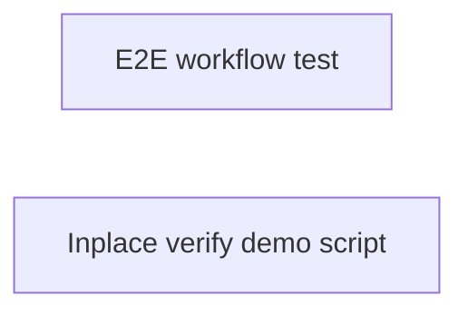

<!-- phase:task skill:taiyi-task gate:auto est:15min produces:TASK.md upstream:[design,requirement] downstream:[dev,test] cplx:[ALL]2steps +[M+]2 +[H]1 -->
# TASK: E2E Demo

> **总Slice**: 2 | **预估**: 3d | **并行**: 2

---

## Step 1: Dependency Graph
> **[ALL]** Goal: 一眼看清依赖 | Inputs: DESIGN.md
<!-- Action: Mermaid图，箭头=依赖 -->

<!-- Validate: 无循环依赖 -->

---

## Step 2: Slice Breakdown
> **[ALL]** Goal: 每个Slice独立可交付 | Inputs: Step1+DESIGN.md §5
<!-- Action: 每个Slice=独立PR，含文件清单/验证命令/验收点/依赖/并行性/Completeness -->

### Slice S1: E2E workflow test
> **[ALL]** | ⇧ 无 | ⇶ ✅可并行 | Score: [N]/10 — 评估基准: read_files√ + write_files√ + verify√ + checkpoints≥3 + rollback√ = 8/10+

Vitest-based E2E that validates all nine phases complete with gates passing. Seeds change artifacts via E2E_ARTIFACTS fixtures, runs completePhase for each, and asserts final workflowStatus === 'completed'.

**read_files**（只读 · 不写）:
- `src/core/workflow-engine.ts`
- `src/core/e2e-fixtures.ts`
- `src/core/run-e2e-workflow.ts`

**write_files**（写边界 · 不越界）:
<!-- R7.3 强约束: 不碰禁动清单，不顺手改其他文件 -->
- `tests/e2e-workflow.test.ts`

**验证**: `npm test -- tests/e2e-workflow.test.ts`

**物理锚点**（git-diff 确认 write_files 已被实际修改）:
> 🪝 实现完成后执行 `git diff --name-only` 确认以下文件出现在 diff 中：
> `tests/e2e-workflow.test.ts`

**验收点**:
- ⬜ All nine phases complete in state.json
- ⬜ Gates pass without manual intervention
- ⬜ Verify report generated with ok:true
- ⬜ 11/11 expected artifacts present on disk

<!-- Validate: 可独立merge/deploy？文件范围精确？ -->

---

### Slice S2: Inplace verify demo script
> **[ALL]** | ⇧ Slice S1 | ⇶ ❌须顺序 | Score: [N]/10 — 评估基准: read_files√ + write_files√ + verify√ + checkpoints≥3 + rollback√ = 8/10+

Node.js script that runs the full SlashFlow in examples/full-flow-demo/.taiyi/archive/ and writes verify-report.json for human inspection.

**read_files**（只读 · 不写）:
- `src/core/run-slash-flow-cli.ts`
- `examples/full-flow-demo/scripts/run-inplace-verify.mjs`

**write_files**（写边界 · 不越界）:
<!-- R7.3 强约束: 不碰禁动清单，不顺手改其他文件 -->
- `examples/full-flow-demo/scripts/run-inplace-verify.mjs`

**验证**: `node examples/full-flow-demo/scripts/run-inplace-verify.mjs`

**物理锚点**（git-diff 确认 write_files 已被实际修改）:
> 🪝 实现完成后执行 `git diff --name-only` 确认以下文件出现在 diff 中：
> `examples/full-flow-demo/scripts/run-inplace-verify.mjs`

**验收点**:
- ⬜ Archive dir has 11 files
- ⬜ verify-report.json shows ok:true
- ⬜ Example appears in docs/QUICKSTART.md runnable list

<!-- Validate: 可独立merge/deploy？文件范围精确？ -->

---

## Step 3: Execution Plan
> **[MEDIUM+]** Goal: 分Wave并行执行 | Inputs: Step2
<!-- Action: 按依赖图分组，无依赖的同Wave并行 -->

### Wave 1 (无依赖,并行)
- S1: e2e workflow test
### Wave 2 (依赖 S1)
- S2: inplace verify demo script

<!-- Validate: 每Wave内部确实无依赖？ -->

## Step 4: Risk per Slice
> **[MEDIUM+]** Goal: 每个Slice风险独立评估 | Inputs: Step2+DESIGN.md §6
<!-- Action: Slice→风险→概率→缓解 -->

| Slice | 风险 | 概率 | 缓解 |
|-------|------|------|------|
| S1 | E2E 假阳性 | 中 | CI 重试 + 人工确认 |
| S2 | 夹具数据漂移 | 低 | E2E_ARTIFACTS 作为唯一真源 |

<!-- Validate: 高风险Slice有独立回滚？ -->

## Step 5: Rollback per Slice
> **[HIGH]** Goal: 每个Slice可独立安全回退 | Inputs: Step4
<!-- Action: 回滚方式+预计时间+数据影响 -->

| Slice | 回滚方式 | 时间 | 数据影响 |
|-------|---------|------|---------|
| S1 | git revert | ≤5 min | 无数据影响 |
| S2 | git revert | ≤5 min | 无数据影响 |

<!-- Validate: 每个Slice可独立回滚？数据一致性？ -->

> 📎 **SSOT 规则**: 切片风险基于 [DESIGN.md §Blast Radius](DESIGN.md) 细分，不回重新评估。切片回滚基于 [CHANGE.md](CHANGE.md) 的 rollback_{trigger,ops,time} 做切片级适配（≤5min/md-only）。
>
> 📎 **多 Slice 并行模式**: 若变更拆为多个可并行发版的 Slice（对应独立 PR），每个 Slice 可生成独立的 `TEST-{slice}.md` 和 `REVIEW-{slice}.md`（ultrawork 模式）。宏观的 TEST.md / REVIEW.md 仅作为阶段级摘要；CI 流式合并以 Slice 级 TEST / REVIEW 为门控单元。

---
## Quality Gate
<!-- Evidence-first: 每个Slice可独立验证交付。gstack cognitive#13: 先重构再实现，不把结构+行为放同一个PR -->

- [ ] S1 依赖图无循环
- [ ] S2 每个Slice可独立交付
- [ ] S2 每个Slice有 read_files/write_files + 验证 + 验收点
- [ ] S2 每个Slice有Completeness评分
- [ ] [M+] S3 Wave分波合理
- [ ] [M+] S4 每Slice风险已评估
- [ ] [H]  S5 每Slice有独立回滚
- [ ] **PITFALLS.md**: 已扫描触达模块的 PITFALLS（`.pitfalls/scan.sh --module <path>` + 人工 grep 关键词），无已知踩坑或已声明规避方案
- [ ] **项目上下文**: 已查 PHASE-CONTEXT.md 既有抽象索引，无重复实现
- [ ] **Refactor-first**: 重构PR和功能PR分开了？(gstack: make change easy, then make easy change)
